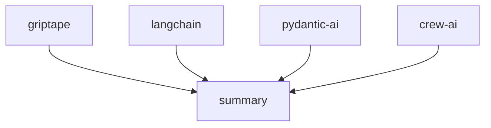

[](https://pypi.python.org/pypi/griptape)
[](https://github.com/griptape-ai/griptape/actions/workflows/unit-tests.yml)
[](https://griptape.readthedocs.io/)
[](https://microsoft.github.io/pyright/)
[](https://github.com/astral-sh/ruff)
[](https://codecov.io/github/griptape-ai/griptape)
[](https://discord.gg/griptape)

# Griptape: Build Powerful GenAI Applications with Ease

Griptape is a Python framework that simplifies the development of Generative AI (GenAI) applications, offering flexible abstractions for building sophisticated AI-powered solutions. ([See the original repo](https://github.com/griptape-ai/griptape))

## Key Features

*   **Modular Architecture:** Build GenAI applications using composable components like Agents, Pipelines, and Workflows.
*   **LLM Integration:** Seamlessly interact with Large Language Models (LLMs) using prompt drivers and advanced memory management.
*   **RAG Capabilities:** Implement Retrieval-Augmented Generation (RAG) pipelines for enhanced information retrieval.
*   **Extensive Driver Support:** Connect to external services and resources with a comprehensive suite of drivers for:
    *   LLMs and Orchestration
    *   Retrieval and Storage
    *   Multimodal Interactions (Image generation, Text to Speech)
    *   Web interaction (Search and Scraping)
    *   Observability
*   **Powerful Tools:** Utilize built-in tools and easily create custom tools for LLMs to interact with data and services.
*   **Engines for Specific Use Cases:** Leverage pre-built engines for tasks like RAG, data extraction, summarization, and evaluation.
*   **Additional Components:** Utilize Rulesets, Loaders, Artifacts, Chunkers, and Tokenizers for advanced control and flexibility.

## Core Components

### Structures

*   **Agents:** Agent-specific behaviors are configured within each Task.
*   **Pipelines:** Arrange Tasks sequentially, allowing the output of one to flow into the next.
*   **Workflows:** Configure Tasks to execute in parallel.

### Tasks

Tasks are the fundamental building blocks for interacting with Engines, Tools, and other Griptape components.

### Memory

*   **Conversation Memory:** Maintain and retrieve information across multiple interactions.
*   **Task Memory:** Keeps large or sensitive Task outputs off the prompt that is sent to the LLM.
*   **Meta Memory:** Enhance context and relevance by passing metadata to the LLM.

### Drivers

Drivers connect to external resources and services.

**LLM & Orchestration**
- **Prompt Drivers**: Manage textual and image interactions with LLMs.
- **Assistant Drivers**: Enable interactions with various “assistant” services.
- **Ruleset Drivers**: Load and apply rulesets from external sources.
- **Conversation Memory Drivers**: Store and retrieve conversational data.
- **Event Listener Drivers**: Forward framework events to external services.
- **Structure Run Drivers**: Execute structures locally or in the cloud.

**Retrieval & Storage**
- **Embedding Drivers**: Generate vector embeddings from textual inputs.
- **Rerank Drivers**: Rerank search results for improved relevance.
- **Vector Store Drivers**: Manage the storage and retrieval of embeddings.
- **File Manager Drivers**: Handle file operations on local and remote storage.
- **SQL Drivers**: Interact with SQL databases.

**Multimodal**
- **Image Generation Drivers**: Create images from text descriptions.
- **Text to Speech Drivers**: Convert text to speech.
- **Audio Transcription Drivers**: Convert audio to text.

**Web**
- **Web Search Drivers**: Search the web for information.
- **Web Scraper Drivers**: Extract data from web pages.

**Observability**
- **Observability Drivers**: Send trace and event data to observability platforms.

### Tools

Tools empower LLMs to interact with data and external services.  Griptape provides [built-in Tools](https://docs.griptape.ai/stable/griptape-framework/tools/official-tools/) and makes it easy to create [custom Tools](https://docs.griptape.ai/stable/griptape-framework/tools/custom-tools/).

### Engines

Engines wrap Drivers to offer specific functionalities:

*   **RAG Engine:** For Retrieval Augmented Generation (RAG) pipelines.
*   **Extraction Engine:** Extract JSON or CSV data.
*   **Summary Engine:** Generate summaries from textual content.
*   **Eval Engine:** Evaluate the quality of generated text.

### Additional Components

*   **Rulesets:** Steer LLM behavior.
*   **Loaders:** Load data from a variety of sources.
*   **Artifacts:** Pass data between components.
*   **Chunkers:** Segment text.
*   **Tokenizers:** Count tokens.

## Documentation

Visit the [docs](https://docs.griptape.ai/) for installation and usage instructions. Explore [Griptape Trade School](https://learn.griptape.ai/) for free online courses.

## Examples

### Hello World

```python
from griptape.drivers.prompt.openai import OpenAiChatPromptDriver
from griptape.rules import Rule
from griptape.tasks import PromptTask

task = PromptTask(
    prompt_driver=OpenAiChatPromptDriver(model="gpt-4.1"),
    rules=[Rule("Keep your answer to a few sentences.")],
)

result = task.run("How do I do a kickflip?")

print(result.value)
```

### Task and Workflow

```python
from griptape.drivers.prompt.openai_chat_prompt_driver import OpenAiChatPromptDriver
from griptape.drivers.web_search.duck_duck_go import DuckDuckGoWebSearchDriver
from griptape.rules import Rule, Ruleset
from griptape.structures import Workflow
from griptape.tasks import PromptTask, TextSummaryTask
from griptape.tools import WebScraperTool, WebSearchTool
from griptape.utils import StructureVisualizer
from pydantic import BaseModel


class Feature(BaseModel):
    name: str
    description: str
    emoji: str


class Output(BaseModel):
    answer: str
    key_features: list[Feature]


projects = ["griptape", "langchain", "crew-ai", "pydantic-ai"]

prompt_driver = OpenAiChatPromptDriver(model="gpt-4.1")
workflow = Workflow(
    tasks=[
        [
            PromptTask(
                id=f"project-{project}",
                input="Tell me about the open source project: {{ project }}.",
                prompt_driver=prompt_driver,
                context={"project": projects},
                output_schema=Output,
                tools=[
                    WebSearchTool(
                        web_search_driver=DuckDuckGoWebSearchDriver(),
                    ),
                    WebScraperTool(),
                ],
                child_ids=["summary"],
            )
            for project in projects
        ],
        TextSummaryTask(
            input="{{ parents_output_text }}",
            id="summary",
            rulesets=[
                Ruleset(
                    name="Format", rules=[Rule("Be detailed."), Rule("Include emojis.")]
                )
            ],
        ),
    ]
)

workflow.run()

print(StructureVisualizer(workflow).to_url())
```



## Versioning

Griptape uses [Semantic Versioning](https://semver.org/).

## Contributing

See the [Contributing Guidelines](https://github.com/griptape-ai/griptape/blob/main/CONTRIBUTING.md).

## License

Griptape is licensed under the Apache 2.0 License.