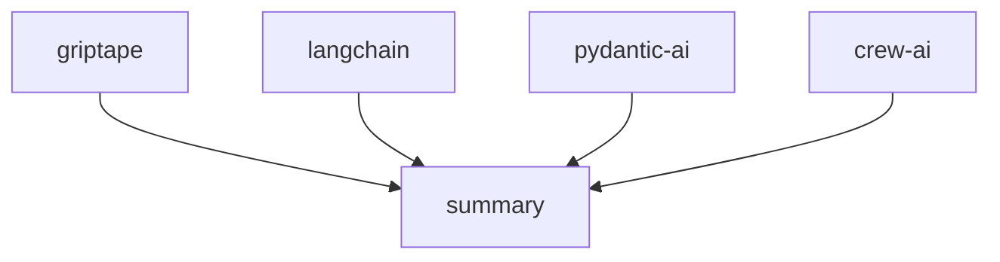

[](https://pypi.python.org/pypi/griptape)
[](https://github.com/griptape-ai/griptape/actions/workflows/unit-tests.yml)
[](https://griptape.readthedocs.io/)
[](https://microsoft.github.io/pyright/)
[](https://github.com/astral-sh/ruff)
[](https://codecov.io/github/griptape-ai/griptape)
[](https://discord.gg/griptape)

# Griptape: Build Powerful GenAI Applications with Ease

Griptape is a Python framework empowering developers to rapidly build and deploy advanced Generative AI (GenAI) applications. ([See the original repo](https://github.com/griptape-ai/griptape))

## Key Features

*   **Modular Architecture**: Build applications with reusable components like Agents, Pipelines, and Workflows.
*   **Simplified LLM Integration**: Easily work with Large Language Models through intuitive prompt and driver abstractions.
*   **Retrieval-Augmented Generation (RAG)**: Implement RAG pipelines with dedicated Engines and drivers for enhanced context.
*   **Extensive Tooling**: Leverage a rich library of built-in tools and easily create custom tools to interact with data and services.
*   **Memory Management**: Utilize conversation, task, and meta memory to enable more intelligent and context-aware interactions.
*   **Flexible Drivers**: Swap out providers and functionality with minimal code changes using a variety of drivers for different use cases.

## Core Components

### Structures

*   **Agents:** Single-task structures for agent-specific behavior.
*   **Pipelines:** Organize sequential task execution.
*   **Workflows:** Execute tasks in parallel.

### Tasks

The fundamental building blocks for interacting with Engines, Tools, and other Griptape components.

### Memory

*   **Conversation Memory:** Retain and retrieve conversational information across interactions.
*   **Task Memory:** Keeps large outputs off prompts for efficiency.
*   **Meta Memory:** Pass additional metadata to enhance context.

### Drivers

Facilitate interactions with external resources and services.

*   **LLM & Orchestration:** Prompt, Assistant, Ruleset, Conversation Memory, Event Listener, and Structure Run Drivers.
*   **Retrieval & Storage:** Embedding, Rerank, Vector Store, File Manager, and SQL Drivers.
*   **Multimodal:** Image Generation, Text to Speech, and Audio Transcription Drivers.
*   **Web:** Web Search and Web Scraper Drivers.
*   **Observability:** Observability Drivers.

### Tools

Provide capabilities for LLMs to interact with data and services.  [See built-in Tools](https://docs.griptape.ai/stable/griptape-framework/tools/official-tools/) and [learn how to create custom Tools](https://docs.griptape.ai/stable/griptape-framework/tools/custom-tools/).

### Engines

Wrap Drivers and provide use-case-specific functionality: RAG, Extraction, Summary, and Eval Engines.

### Additional Components

*   Rulesets
*   Loaders
*   Artifacts
*   Chunkers
*   Tokenizers

## Documentation

Comprehensive documentation is available at [https://docs.griptape.ai/](https://docs.griptape.ai/).

Explore the [Griptape Trade School](https://learn.griptape.ai/) for free online courses.

## Example: Hello World

```python
from griptape.drivers.prompt.openai import OpenAiChatPromptDriver
from griptape.rules import Rule
from griptape.tasks import PromptTask

task = PromptTask(
    prompt_driver=OpenAiChatPromptDriver(model="gpt-4.1"),
    rules=[Rule("Keep your answer to a few sentences.")],
)

result = task.run("How do I do a kickflip?")

print(result.value)
```

```text
To do a kickflip, start by positioning your front foot slightly angled near the middle of the board and your back foot on the tail.
Pop the tail down with your back foot while flicking the edge of the board with your front foot to make it spin.
Jump and keep your body centered over the board, then catch it with your feet and land smoothly. Practice and patience are key!
```

## Example: Task and Workflow

```python
from griptape.drivers.prompt.openai_chat_prompt_driver import OpenAiChatPromptDriver
from griptape.drivers.web_search.duck_duck_go import DuckDuckGoWebSearchDriver
from griptape.rules import Rule, Ruleset
from griptape.structures import Workflow
from griptape.tasks import PromptTask, TextSummaryTask
from griptape.tools import WebScraperTool, WebSearchTool
from griptape.utils import StructureVisualizer
from pydantic import BaseModel


class Feature(BaseModel):
    name: str
    description: str
    emoji: str


class Output(BaseModel):
    answer: str
    key_features: list[Feature]


projects = ["griptape", "langchain", "crew-ai", "pydantic-ai"]

prompt_driver = OpenAiChatPromptDriver(model="gpt-4.1")
workflow = Workflow(
    tasks=[
        [
            PromptTask(
                id=f"project-{project}",
                input="Tell me about the open source project: {{ project }}.",
                prompt_driver=prompt_driver,
                context={"project": projects},
                output_schema=Output,
                tools=[
                    WebSearchTool(
                        web_search_driver=DuckDuckGoWebSearchDriver(),
                    ),
                    WebScraperTool(),
                ],
                child_ids=["summary"],
            )
            for project in projects
        ],
        TextSummaryTask(
            input="{{ parents_output_text }}",
            id="summary",
            rulesets=[
                Ruleset(
                    name="Format", rules=[Rule("Be detailed."), Rule("Include emojis.")]
                )
            ],
        ),
    ]
)

workflow.run()

print(StructureVisualizer(workflow).to_url())
```

```text
 Output: Here's a detailed summary of the open-source projects mentioned:

 1. **Griptape** 🛠️:                                                                                                            
    - Griptape is a modular Python framework designed for creating AI-powered applications. It focuses on securely connecting to
 enterprise data and APIs. The framework provides structured components like Agents, Pipelines, and Workflows, allowing for both
 parallel and sequential operations. It includes built-in tools and supports custom tool creation for data and service
 interaction.

 2. **LangChain** 🔗:
    - LangChain is a framework for building applications powered by Large Language Models (LLMs). It offers a standard interface
 for models, embeddings, and vector stores, facilitating real-time data augmentation and model interoperability. LangChain
 integrates with various data sources and external systems, making it adaptable to evolving technologies.

 3. **CrewAI** 🤖:
    - CrewAI is a standalone Python framework for orchestrating multi-agent AI systems. It allows developers to create and
 manage AI agents that collaborate on complex tasks. CrewAI emphasizes ease of use and scalability, providing tools and
 documentation to help developers build AI-powered solutions.

 4. **Pydantic-AI** 🧩:
    - Pydantic-AI is a Python agent framework that simplifies the development of production-grade applications with Generative
 AI. Built on Pydantic, it supports various AI models and provides features like type-safe design, structured response
 validation, and dependency injection. Pydantic-AI aims to bring the ease of FastAPI development to AI applications.

 These projects offer diverse tools and frameworks for developing AI applications, each with unique features and capabilities
 tailored to different aspects of AI development.
```



## Versioning

Griptape uses [Semantic Versioning](https://semver.org/).

## Contributing

Contribute to Griptape! Review our [Contributing Guidelines](https://github.com/griptape-ai/griptape/blob/main/CONTRIBUTING.md).

## License

Griptape is available under the Apache 2.0 License.