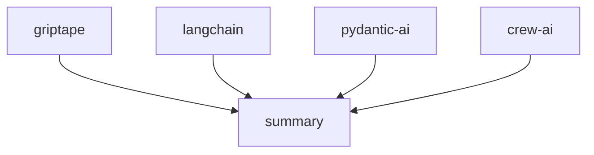

[](https://pypi.python.org/pypi/griptape)
[](https://github.com/griptape-ai/griptape/actions/workflows/unit-tests.yml)
[](https://griptape.readthedocs.io/)
[](https://microsoft.github.io/pyright/)
[](https://github.com/astral-sh/ruff)
[](https://codecov.io/github/griptape-ai/griptape)
[](https://discord.gg/griptape)

# Griptape: Build Powerful GenAI Applications with Ease

**Griptape is a flexible Python framework empowering developers to build robust and scalable Generative AI applications.** Explore the [Griptape GitHub repository](https://github.com/griptape-ai/griptape) to get started.

## Key Features

*   **Modular Structure:** Build AI applications using Agents, Pipelines, and Workflows for organized task execution.
*   **Versatile Tasks:** Utilize Tasks as core building blocks to interact with Engines, Tools, and other Griptape components.
*   **Intelligent Memory:** Leverage Conversation, Task, and Meta Memory for context-aware interactions.
*   **Extensible Drivers:** Connect to external resources and services with configurable Drivers.
    *   **LLM & Orchestration Drivers:** Manage interactions with LLMs and various assistant services.
    *   **Retrieval & Storage Drivers:** Generate embeddings, manage vector stores, and handle file operations.
    *   **Multimodal Drivers:** Create images, convert text to speech and vice versa.
    *   **Web Drivers:** Search and scrape web pages.
    *   **Observability Drivers**: Send trace and event data to observability platforms.
*   **Built-in Tools:** Access a range of tools for data interaction and service integration, with easy custom tool creation.
*   **Specialized Engines:** Implement Retrieval Augmented Generation (RAG), extraction, and summarization pipelines with ease.
*   **Additional Components:** Utilize Rulesets, Loaders, Artifacts, Chunkers, and Tokenizers to fine-tune and control your GenAI applications.

## Core Components in Detail

### 🏗️ Structures

*   🤖 **Agents:** Single-task configurations for Agent-specific behavior.
*   🔄 **Pipelines:** Sequences of Tasks for data flow.
*   🌐 **Workflows:** Parallel execution of Tasks.

### 📝 Tasks

Tasks are the fundamental building blocks for interacting with Engines, Tools, and other Griptape components.

### 🧠 Memory

*   💬 **Conversation Memory:** Retains information across interactions.
*   🗃️ **Task Memory:** Keeps large or sensitive Task outputs off the prompt.
*   📊 **Meta Memory:** Passes in additional metadata to the LLM.

### 🚗 Drivers

Drivers facilitate interactions with external resources and services.

#### LLM & Orchestration
- 🗣️ **Prompt Drivers**: Manage textual and image interactions with LLMs.
- 🤖 **Assistant Drivers**: Enable interactions with various “assistant” services.
- 📜 **Ruleset Drivers**: Load and apply rulesets from external sources.
- 🧠 **Conversation Memory Drivers**: Store and retrieve conversational data.
- 📡 **Event Listener Drivers**: Forward framework events to external services.
- 🏗️ **Structure Run Drivers**: Execute structures locally or in the cloud.

#### Retrieval & Storage
- 🔢 **Embedding Drivers**: Generate vector embeddings from textual inputs.
- 🔀 **Rerank Drivers**: Rerank search results for improved relevance.
- 💾 **Vector Store Drivers**: Manage the storage and retrieval of embeddings.
- 🗂️ **File Manager Drivers**: Handle file operations on local and remote storage.
- 💼 **SQL Drivers**: Interact with SQL databases.

#### Multimodal
- 🎨 **Image Generation Drivers**: Create images from text descriptions.
- 🗣️ **Text to Speech Drivers**: Convert text to speech.
- 🎙️ **Audio Transcription Drivers**: Convert audio to text.

#### Web
- 🔍 **Web Search Drivers**: Search the web for information.
- 🌐 **Web Scraper Drivers**: Extract data from web pages.

#### Observability
- 📈 **Observability Drivers**: Send trace and event data to observability platforms.

### 🔧 Tools

Tools enable LLMs to interact with data and services. Access a variety of [built-in Tools](https://docs.griptape.ai/stable/griptape-framework/tools/official-tools/) and create [custom Tools](https://docs.griptape.ai/stable/griptape-framework/tools/custom-tools/).

### 🚂 Engines

Engines wrap Drivers to provide use-case-specific functionality:

*   📊 **RAG Engine:** Implement modular Retrieval Augmented Generation (RAG) pipelines.
*   🛠️ **Extraction Engine:** Extract JSON or CSV data from unstructured text.
*   📝 **Summary Engine:** Generate summaries from textual content.
*   ✅ **Eval Engine:** Evaluate and score generated text.

### 📦 Additional Components

*   📐 **Rulesets:** Steer LLM behavior.
*   🔄 **Loaders:** Load data from various sources.
*   🏺 **Artifacts:** Pass data between Griptape components.
*   ✂️ **Chunkers:** Segment texts into manageable pieces.
*   🔢 **Tokenizers:** Count tokens.

## Get Started

Explore the [documentation](https://docs.griptape.ai/) for installation and usage details.

## Examples

### Hello World

```python
from griptape.drivers.prompt.openai import OpenAiChatPromptDriver
from griptape.rules import Rule
from griptape.tasks import PromptTask

task = PromptTask(
    prompt_driver=OpenAiChatPromptDriver(model="gpt-4.1"),
    rules=[Rule("Keep your answer to a few sentences.")],
)

result = task.run("How do I do a kickflip?")

print(result.value)
```

```text
To do a kickflip, start by positioning your front foot slightly angled near the middle of the board and your back foot on the tail.
Pop the tail down with your back foot while flicking the edge of the board with your front foot to make it spin.
Jump and keep your body centered over the board, then catch it with your feet and land smoothly. Practice and patience are key!
```

### Task and Workflow Example

```python
from griptape.drivers.prompt.openai_chat_prompt_driver import OpenAiChatPromptDriver
from griptape.drivers.web_search.duck_duck_go import DuckDuckGoWebSearchDriver
from griptape.rules import Rule, Ruleset
from griptape.structures import Workflow
from griptape.tasks import PromptTask, TextSummaryTask
from griptape.tools import WebScraperTool, WebSearchTool
from griptape.utils import StructureVisualizer
from pydantic import BaseModel


class Feature(BaseModel):
    name: str
    description: str
    emoji: str


class Output(BaseModel):
    answer: str
    key_features: list[Feature]


projects = ["griptape", "langchain", "crew-ai", "pydantic-ai"]

prompt_driver = OpenAiChatPromptDriver(model="gpt-4.1")
workflow = Workflow(
    tasks=[
        [
            PromptTask(
                id=f"project-{project}",
                input="Tell me about the open source project: {{ project }}.",
                prompt_driver=prompt_driver,
                context={"project": projects},
                output_schema=Output,
                tools=[
                    WebSearchTool(
                        web_search_driver=DuckDuckGoWebSearchDriver(),
                    ),
                    WebScraperTool(),
                ],
                child_ids=["summary"],
            )
            for project in projects
        ],
        TextSummaryTask(
            input="{{ parents_output_text }}",
            id="summary",
            rulesets=[
                Ruleset(
                    name="Format", rules=[Rule("Be detailed."), Rule("Include emojis.")]
                )
            ],
        ),
    ]
)

workflow.run()

print(StructureVisualizer(workflow).to_url())
```

```text
 Output: Here's a detailed summary of the open-source projects mentioned:

 1. **Griptape** 🛠️:                                                                                                            
    - Griptape is a modular Python framework designed for creating AI-powered applications. It focuses on securely connecting to
 enterprise data and APIs. The framework provides structured components like Agents, Pipelines, and Workflows, allowing for both
 parallel and sequential operations. It includes built-in tools and supports custom tool creation for data and service
 interaction.

 2. **LangChain** 🔗:
    - LangChain is a framework for building applications powered by Large Language Models (LLMs). It offers a standard interface
 for models, embeddings, and vector stores, facilitating real-time data augmentation and model interoperability. LangChain
 integrates with various data sources and external systems, making it adaptable to evolving technologies.

 3. **CrewAI** 🤖:
    - CrewAI is a standalone Python framework for orchestrating multi-agent AI systems. It allows developers to create and
 manage AI agents that collaborate on complex tasks. CrewAI emphasizes ease of use and scalability, providing tools and
 documentation to help developers build AI-powered solutions.

 4. **Pydantic-AI** 🧩:
    - Pydantic-AI is a Python agent framework that simplifies the development of production-grade applications with Generative
 AI. Built on Pydantic, it supports various AI models and provides features like type-safe design, structured response
 validation, and dependency injection. Pydantic-AI aims to bring the ease of FastAPI development to AI applications.

 These projects offer diverse tools and frameworks for developing AI applications, each with unique features and capabilities
 tailored to different aspects of AI development.
```



## Versioning

Uses [Semantic Versioning](https://semver.org/).

## Contribute

Review the [Contributing Guidelines](https://github.com/griptape-ai/griptape/blob/main/CONTRIBUTING.md).

## License

Available under the Apache 2.0 License.