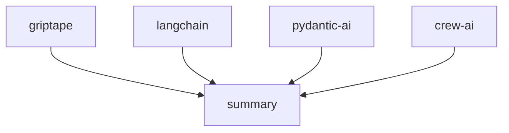

[](https://pypi.python.org/pypi/griptape)
[](https://github.com/griptape-ai/griptape/actions/workflows/unit-tests.yml)
[](https://griptape.readthedocs.io/)
[](https://microsoft.github.io/pyright/)
[](https://github.com/astral-sh/ruff)
[](https://codecov.io/github/griptape-ai/griptape)
[](https://discord.gg/griptape)

# Griptape: Build Powerful GenAI Applications with Ease

**Griptape is a Python framework that streamlines the development of Generative AI (GenAI) applications, offering flexible abstractions for LLMs, RAG, and more.**

## Key Features

*   **Modular Architecture:** Build applications using core components like Agents, Pipelines, and Workflows.
*   **Flexible Tasks:** Utilize tasks as building blocks to interact with Engines, Tools, and other Griptape components.
*   **Advanced Memory Management:** Leverage Conversation, Task, and Meta Memory for enhanced context and data persistence.
*   **Versatile Drivers:** Connect to external resources and services with configurable Drivers for LLMs, Retrieval, Storage, and more.
*   **Extensive Tooling:** Integrate a wide range of built-in and custom tools for data interaction and service integration.
*   **Specialized Engines:** Utilize pre-built engines for RAG, Extraction, Summarization, and Evaluation.
*   **Additional Components:** Benefit from Rulesets, Loaders, Artifacts, and Chunkers to enhance application functionality.

## Core Components

### Structures

*   **Agents:** Single-task configurations for agent-specific behavior.
*   **Pipelines:** Sequential task organization.
*   **Workflows:** Parallel task configuration.

### Tasks

*   Essential building blocks for interaction with Engines, Tools, and other Griptape components.

### Memory

*   **Conversation Memory:** Retain information across interactions.
*   **Task Memory:** Keep outputs off the LLM prompt.
*   **Meta Memory:** Pass additional metadata for context.

### Drivers

Facilitate interactions with external resources and services:

*   **LLM & Orchestration Drivers:** Prompt, Assistant, Ruleset, Conversation Memory, Event Listener, and Structure Run Drivers.
*   **Retrieval & Storage Drivers:** Embedding, Rerank, Vector Store, File Manager, and SQL Drivers.
*   **Multimodal Drivers:** Image Generation, Text-to-Speech, and Audio Transcription Drivers.
*   **Web Drivers:** Web Search and Web Scraper Drivers.
*   **Observability Drivers:** Send trace and event data to observability platforms.

### Tools

*   Enable LLMs to interact with data and services.
*   Includes [built-in Tools](https://docs.griptape.ai/stable/griptape-framework/tools/official-tools/) and supports [custom Tool](https://docs.griptape.ai/stable/griptape-framework/tools/custom-tools/) creation.

### Engines

Use-case-specific functionality:

*   **RAG Engine:** Retrieval Augmented Generation (RAG) pipelines.
*   **Extraction Engine:** Extract data from unstructured text.
*   **Summary Engine:** Generate summaries.
*   **Eval Engine:** Evaluate text quality.

### Additional Components

*   **Rulesets:** Steer LLM behavior.
*   **Loaders:** Load data from various sources.
*   **Artifacts:** Pass data between components.
*   **Chunkers:** Segment texts.
*   **Tokenizers:** Count tokens.

## Examples

### Hello World

```python
from griptape.drivers.prompt.openai import OpenAiChatPromptDriver
from griptape.rules import Rule
from griptape.tasks import PromptTask

task = PromptTask(
    prompt_driver=OpenAiChatPromptDriver(model="gpt-4.1"),
    rules=[Rule("Keep your answer to a few sentences.")],
)

result = task.run("How do I do a kickflip?")

print(result.value)
```

### Task and Workflow Example

```python
from griptape.drivers.prompt.openai_chat_prompt_driver import OpenAiChatPromptDriver
from griptape.drivers.web_search.duck_duck_go import DuckDuckGoWebSearchDriver
from griptape.rules import Rule, Ruleset
from griptape.structures import Workflow
from griptape.tasks import PromptTask, TextSummaryTask
from griptape.tools import WebScraperTool, WebSearchTool
from griptape.utils import StructureVisualizer
from pydantic import BaseModel


class Feature(BaseModel):
    name: str
    description: str
    emoji: str


class Output(BaseModel):
    answer: str
    key_features: list[Feature]


projects = ["griptape", "langchain", "crew-ai", "pydantic-ai"]

prompt_driver = OpenAiChatPromptDriver(model="gpt-4.1")
workflow = Workflow(
    tasks=[
        [
            PromptTask(
                id=f"project-{project}",
                input="Tell me about the open source project: {{ project }}.",
                prompt_driver=prompt_driver,
                context={"project": projects},
                output_schema=Output,
                tools=[
                    WebSearchTool(
                        web_search_driver=DuckDuckGoWebSearchDriver(),
                    ),
                    WebScraperTool(),
                ],
                child_ids=["summary"],
            )
            for project in projects
        ],
        TextSummaryTask(
            input="{{ parents_output_text }}",
            id="summary",
            rulesets=[
                Ruleset(
                    name="Format", rules=[Rule("Be detailed."), Rule("Include emojis.")]
                )
            ],
        ),
    ]
)

workflow.run()

print(StructureVisualizer(workflow).to_url())
```



## Documentation

Refer to the [docs](https://docs.griptape.ai/) for installation and usage instructions.

Check out [Griptape Trade School](https://learn.griptape.ai/) for free online courses.

## Versioning

Griptape uses [Semantic Versioning](https://semver.org/).

## Contributing

Contribute to Griptape! Review the [Contributing Guidelines](https://github.com/griptape-ai/griptape/blob/main/CONTRIBUTING.md) before getting started.

## License

Griptape is licensed under the Apache 2.0 License.

## Get Started

Explore the power of Griptape on [GitHub](https://github.com/griptape-ai/griptape)!