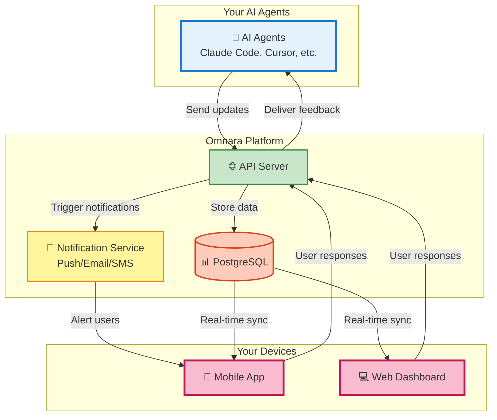

# Omnara - Mission Control for Your AI Agents 🚀

<div align="center">

**Your AI workforce, in your pocket.**

[](https://badge.fury.io/py/omnara)
[](https://pepy.tech/project/omnara)
[](https://pypi.org/project/omnara/)
[](https://opensource.org/licenses/Apache-2.0)
[](https://github.com/omnara-ai/omnara)
[](https://github.com/astral-sh/ruff)

</div>


<div align="center">

[📱 **Download iOS App**](https://apps.apple.com/us/app/omnara-ai-command-center/id6748426727) • [🌐 **Try Web Dashboard**](https://omnara.ai) • [🎥 **See a Demo**](https://www.loom.com/share/03d30efcf8e44035af03cbfebf840c73?sid=1c209c04-8a4c-4dd6-8c92-735c399886a6) • [⭐ **Star on GitHub**](https://github.com/omnara-ai/omnara)

</div>

---

## 🚀 Quick Start

```bash
# Install Omnara
pip install omnara

# Start a Claude Code session that's synced between terminal, web, and mobile
omnara
```

That's it! Create an account when prompted, then return to your terminal to interact with Claude Code. You can now see and interact with your Claude Code session from the [web dashboard](https://omnara.ai/dashboard) or the [mobile app](https://apps.apple.com/us/app/omnara-ai-command-center/id6748426727).

## 💡 What is Omnara?

Omnara transforms your AI agents (Claude Code, Cursor, GitHub Copilot, and more) from silent workers into communicative teammates. Get real-time visibility into what your agents are doing, respond to their questions instantly, and guide them to success - all from your phone.

### ✨ Key Features

| Feature | Description |
|---------|------------|
| **📊 Real-Time Monitoring** | See every step your AI agents take as they work |
| **💬 Interactive Q&A** | Respond instantly when agents need guidance |
| **📱 Mobile-First Design** | Full control from your phone, tablet, or desktop |
| **🔔 Smart Notifications** | Get alerted only when your input is needed |
| **🎯 Universal Dashboard** | All your AI agents in one unified interface |

### 🎬 See It In Action


> *The moment your agent needs help, you're there. No more returning to failed jobs hours later.*


## 💡 Why Omnara?

We built Omnara because we were tired of:
- ❌ Starting long agent jobs and finding them stuck hours later
- ❌ Missing critical questions that blocked progress
- ❌ Having no visibility into what our AI was actually doing
- ❌ Being tied to our desks while agents worked

**Now you can:**
- ✅ Launch agents and monitor them from anywhere
- ✅ Get push notifications when input is needed
- ✅ Send real-time feedback to guide your agents
- ✅ Have confidence your AI workforce is productive

## 🏗️ Architecture Overview

Omnara provides a unified platform for monitoring and controlling your AI agents:



### 🚀 How It Works

**1. Connect Your Agent** → Install Omnara SDK or wrapper  
**2. Get Real-Time Updates** → See every step your agent takes  
**3. Respond Instantly** → Answer questions from anywhere  

### 🔄 Two Ways to Use Omnara

| Mode | Setup | How It Works |
|------|-------|-------------|
| **Real-Time Monitoring** | `omnara` or `uv run omnara` | Monitor your Claude session, forwards to Omnara |
| **Remote Launch** | `omnara serve` or `uv run omnara serve` | Launch agents from phone, communicate via MCP |

### 🔧 Technical Stack

- **Backend**: FastAPI with separate read/write servers for optimal performance
- **Frontend**: React (Web) + React Native (Mobile)
- **Protocol**: Model Context Protocol (MCP) + REST API
- **Database**: PostgreSQL with SQLAlchemy ORM
- **Auth**: Dual JWT system (Supabase for users, custom for agents)

## 📖 How to Use

### Option 1: Monitor Your Claude Sessions

See what Claude is doing in real-time:

1. **Install Omnara**:
   ```bash
   # Using pip
   pip install omnara
   
   # Using uv (faster)
   uv tool install omnara
   ```
2. **Start monitoring**:
   ```bash
   # If installed with pip or uv
   omnara

   # Using pipx (no omnara installation required)
   pipx run omnara

   # Using uvx (no omnara installation required)
   uvx omnara
   ```
3. **Authenticate** in your browser (opens automatically)
4. **See everything** your agent does in the Omnara dashboard!

### Option 2: Launch Agents Remotely

Trigger Claude from your phone:

1. **Start the server** on your computer:
   ```bash
   # Using pip
   pip install omnara
   omnara serve
   
   # Using uv (faster)
   uv tool install omnara
   omnara serve
   ```
2. **Set up your agent** in the mobile app with the webhook URL shown
3. **Launch agents** from anywhere - beach, coffee shop, bed!

### For Developers

<details>
<summary><b>🛠️ Development Setup</b></summary>

**Prerequisites:** Docker, Python 3.10+, Node.js

**Quick Start:**
```bash
git clone https://github.com/omnara-ai/omnara
cd omnara
cp .env.example .env
python scripts/generate_jwt_keys.py
./dev-start.sh  # Starts everything automatically
```

**Stop services:** `./dev-stop.sh`

For detailed setup instructions, manual configuration, and contribution guidelines, see our [Contributing Guide](CONTRIBUTING.md).

</details>

## 🔧 Advanced Usage (Without CLI)

> **Note**: Most users should use the simple `omnara` or `omnara serve` commands shown above. These methods are for advanced users who need custom integrations or want to run the underlying scripts directly.

### Method 1: Direct Wrapper Script

Run the monitoring wrapper directly (what `omnara` does under the hood):

```bash
# Basic usage
python -m integrations.cli_wrappers.claude_code.claude_wrapper_v3 --api-key YOUR_API_KEY

# With git diff tracking
python -m integrations.cli_wrappers.claude_code.claude_wrapper_v3 --api-key YOUR_API_KEY --git-diff

# Custom API endpoint (for self-hosted)
python -m integrations.cli_wrappers.claude_code.claude_wrapper_v3 --api-key YOUR_API_KEY --base-url https://your-server.com
```

### Method 2: Manual MCP Configuration

For custom MCP setups, you can configure manually:

```json
{
  "mcpServers": {
    "omnara": {
      "command": "pipx",
      "args": ["run", "--no-cache", "omnara", "mcp", "--api-key", "YOUR_API_KEY"]
    }
  }
}
```

### Method 3: Python SDK
```python
from omnara import OmnaraClient
import uuid

client = OmnaraClient(api_key="your-api-key")
instance_id = str(uuid.uuid4())

# Log progress and check for user feedback
response = client.send_message(
    agent_type="claude-code",
    content="Analyzing codebase structure",
    agent_instance_id=instance_id,
    requires_user_input=False
)

# Ask for user input when needed
answer = client.send_message(
    content="Should I refactor this legacy module?",
    agent_instance_id=instance_id,
    requires_user_input=True
)
```

### Method 4: REST API
```bash
curl -X POST https://api.omnara.ai/api/v1/messages/agent \
  -H "Authorization: Bearer YOUR_API_KEY" \
  -H "Content-Type: application/json" \
  -d '{"content": "Starting deployment process", "agent_type": "claude-code", "requires_user_input": false}'
```

## 🤝 Contributing

We love contributions! Check out our [Contributing Guide](CONTRIBUTING.md) to get started.

### Development Commands
```bash
make lint       # Run code quality checks
make format     # Auto-format code
make test       # Run test suite
./dev-start.sh  # Start development servers
```

## 📊 Pricing

| Plan | Price | Features |
|------|-------|----------|
| **Free** | $0/mo | 10 agents/month, Core features |
| **Pro** | $9/mo | Unlimited agents, Priority support |
| **Enterprise** | [Contact Us](https://cal.com/ishaan-sehgal-8kc22w/omnara-demo) | Teams, SSO, Custom integrations |

## 🆘 Support

- 💬 [GitHub Discussions](https://github.com/omnara-ai/omnara/discussions)
- 🐛 [Report Issues](https://github.com/omnara-ai/omnara/issues)
- 📧 [Email Support](mailto:ishaan@omnara.com)
- 📖 Documentation (coming soon)

## 📜 License

Omnara is open source software licensed under the [Apache 2.0 License](LICENSE).

---

<div align="center">

**Built with ❤️ by the Omnara team**

[Website](https://omnara.ai) • [Twitter](https://twitter.com/omnaraai) • [LinkedIn](https://linkedin.com/company/omnara)

</div>
