# Omnara: Supercharge Your AI Agents with Real-Time Visibility and Control 🚀

[Link to original repo: https://github.com/omnara-ai/omnara](https://github.com/omnara-ai/omnara)

Omnara empowers you to effortlessly monitor, manage, and collaborate with your AI agents from anywhere, transforming them from silent workers into responsive teammates.

<div align="center">

[](https://badge.fury.io/py/omnara)
[](https://pepy.tech/project/omnara)
[](https://pypi.org/project/omnara/)
[](https://opensource.org/licenses/Apache-2.0)
[](https://github.com/omnara-ai/omnara)
[](https://github.com/astral-sh/ruff)

</div>


<div align="center">

[📱 **Download iOS App**](https://apps.apple.com/us/app/omnara-ai-command-center/id6748426727) • [🌐 **Try Web Dashboard**](https://omnara.ai) • [🎥 **See a Demo**](https://www.loom.com/share/03d30efcf8e44035af03cbfebf840c73?sid=1c209c04-8a4c-4dd6-8c92-735c399886a6) • [⭐ **Star on GitHub**](https://github.com/omnara-ai/omnara)

</div>

---

## Key Features of Omnara

*   **Real-Time Monitoring:** Observe every action your AI agents undertake as they work.
*   **Interactive Q&A:** Provide immediate feedback and guidance when your agents need it.
*   **Mobile-First Design:** Full control from your phone, tablet, or desktop for seamless accessibility.
*   **Smart Notifications:** Receive alerts precisely when your input is required, ensuring efficiency.
*   **Universal Dashboard:** Manage all your AI agents through a single, unified interface.

### 🎬 See It In Action


> *The moment your agent needs help, you're there. No more returning to failed jobs hours later.*


## Why Choose Omnara?

Omnara addresses the common frustrations of managing AI agents:

*   Eliminate wasted time by catching stalled agents promptly.
*   Prevent project setbacks with real-time interaction and feedback.
*   Gain complete visibility into agent actions for informed decision-making.
*   Maintain productivity and control from anywhere, at any time.

## Architecture Overview

Omnara is built on a robust architecture that provides a unified platform for managing your AI agents:

```mermaid
graph TB
    subgraph "Your AI Agents"
        A[🤖 AI Agents<br/>Claude Code, Cursor, etc.]
    end

    subgraph "Omnara Platform"
        API[🌐 API Server]
        DB[(📊 PostgreSQL)]
        NOTIFY[🔔 Notification Service<br/>Push/Email/SMS]
    end

    subgraph "Your Devices"
        M[📱 Mobile App]
        W[💻 Web Dashboard]
    end

    A -->|Send updates| API
    API -->|Store data| DB
    API -->|Trigger notifications| NOTIFY
    NOTIFY -->|Alert users| M
    DB -->|Real-time sync| M
    DB -->|Real-time sync| W
    M -->|User responses| API
    W -->|User responses| API
    API -->|Deliver feedback| A

    style A fill:#e3f2fd,stroke:#1976d2,stroke-width:3px
    style API fill:#c8e6c9,stroke:#388e3c,stroke-width:2px
    style DB fill:#ffccbc,stroke:#d84315,stroke-width:2px
    style NOTIFY fill:#fff59d,stroke:#f57f17,stroke-width:2px
    style M fill:#f8bbd0,stroke:#c2185b,stroke-width:3px
    style W fill:#f8bbd0,stroke:#c2185b,stroke-width:3px
```



## Getting Started with Omnara

### 🚀 Quick Start

#### Option 1: Monitor Your Claude Sessions

1.  **Install Omnara:**
    ```bash
    # Using pip
    pip install omnara

    # Using uv (faster)
    uv pip install omnara
    ```
2.  **Start monitoring:**
    ```bash
    # If installed with pip
    omnara

    # If installed with uv
    uv run omnara
    ```
3.  **Authenticate** in your browser (opens automatically)
4.  **See everything** your agent does in the Omnara dashboard!

#### Option 2: Launch Agents Remotely

1.  **Start the server** on your computer:
    ```bash
    # Using pip
    pip install omnara
    omnara serve

    # Using uv (faster)
    uv pip install omnara
    uv run omnara serve
    ```
2.  **Set up your agent** in the mobile app with the webhook URL shown
3.  **Launch agents** from anywhere - beach, coffee shop, bed!

### 🔄 Two Ways to Use Omnara

| Mode                 | Setup                                  | How It Works                                   |
| -------------------- | -------------------------------------- | ---------------------------------------------- |
| **Real-Time Monitoring** | `omnara` or `uv run omnara`           | Monitor your Claude session, forwards to Omnara |
| **Remote Launch**      | `omnara serve` or `uv run omnara serve` | Launch agents from phone, communicate via MCP   |

## 🔧 Technical Details

*   **Backend**: FastAPI with separate read/write servers.
*   **Frontend**: React (Web) and React Native (Mobile).
*   **Protocol**: Model Context Protocol (MCP) and REST API.
*   **Database**: PostgreSQL with SQLAlchemy ORM.
*   **Auth**: Dual JWT system (Supabase for users, custom for agents).

### 🔧 Advanced Usage

> **Note**: Most users should use the simple `omnara` or `omnara serve` commands shown above. These methods are for advanced users who need custom integrations or want to run the underlying scripts directly.

### Method 1: Direct Wrapper Script

Run the monitoring wrapper directly (what `omnara` does under the hood):

```bash
# Basic usage
python -m integrations.cli_wrappers.claude_code.claude_wrapper_v3 --api-key YOUR_API_KEY

# With git diff tracking
python -m integrations.cli_wrappers.claude_code.claude_wrapper_v3 --api-key YOUR_API_KEY --git-diff

# Custom API endpoint (for self-hosted)
python -m integrations.cli_wrappers.claude_code.claude_wrapper_v3 --api-key YOUR_API_KEY --base-url https://your-server.com
```

### Method 2: Manual MCP Configuration

For custom MCP setups, you can configure manually:

```json
{
  "mcpServers": {
    "omnara": {
      "command": "pipx",
      "args": ["run", "--no-cache", "omnara", "mcp", "--api-key", "YOUR_API_KEY"]
    }
  }
}
```

### Method 3: Python SDK
```python
from omnara import OmnaraClient
import uuid

client = OmnaraClient(api_key="your-api-key")
instance_id = str(uuid.uuid4())

# Log progress and check for user feedback
response = client.send_message(
    agent_type="claude-code",
    content="Analyzing codebase structure",
    agent_instance_id=instance_id,
    requires_user_input=False
)

# Ask for user input when needed
answer = client.send_message(
    content="Should I refactor this legacy module?",
    agent_instance_id=instance_id,
    requires_user_input=True
)
```

### Method 4: REST API
```bash
curl -X POST https://api.omnara.ai/api/v1/messages/agent \
  -H "Authorization: Bearer YOUR_API_KEY" \
  -H "Content-Type: application/json" \
  -d '{"content": "Starting deployment process", "agent_type": "claude-code", "requires_user_input": false}'
```

### For Developers

<details>
<summary><b>🛠️ Development Setup</b></summary>

**Prerequisites:** Docker, Python 3.10+, Node.js

**Quick Start:**
```bash
git clone https://github.com/omnara-ai/omnara
cd omnara
cp .env.example .env
python scripts/generate_jwt_keys.py
./dev-start.sh  # Starts everything automatically
```

**Stop services:** `./dev-stop.sh`

For detailed setup instructions, manual configuration, and contribution guidelines, see our [Contributing Guide](CONTRIBUTING.md).

</details>

## 🤝 Contributing

We welcome your contributions! Please review our [Contributing Guide](CONTRIBUTING.md) to get started.

### Development Commands
```bash
make lint       # Run code quality checks
make format     # Auto-format code
make test       # Run test suite
./dev-start.sh  # Start development servers
```

## 📊 Pricing

| Plan         | Price    | Features                               |
| ------------ | -------- | -------------------------------------- |
| **Free**     | $0/mo    | 10 agents/month, Core features         |
| **Pro**      | $9/mo    | Unlimited agents, Priority support     |
| **Enterprise** | [Contact Us](https://cal.com/ishaan-sehgal-8kc22w/omnara-demo) | Teams, SSO, Custom integrations |

## 🆘 Support

*   💬 [GitHub Discussions](https://github.com/omnara-ai/omnara/discussions)
*   🐛 [Report Issues](https://github.com/omnara-ai/omnara/issues)
*   📧 [Email Support](mailto:ishaan@omnara.com)
*   📖 Documentation (coming soon)

## 📜 License

Omnara is licensed under the [Apache 2.0 License](LICENSE).

---

<div align="center">

**Built with ❤️ by the Omnara team**

[Website](https://omnara.ai) • [Twitter](https://twitter.com/omnaraai) • [LinkedIn](https://linkedin.com/company/omnara)

</div>