# Omnara: Take Control of Your AI Agents 🚀

**Supercharge your AI agents and boost productivity with Omnara, the AI command center in your pocket.**

[](https://badge.fury.io/py/omnara)
[](https://pepy.tech/project/omnara)
[](https://pypi.org/project/omnara/)
[](https://opensource.org/licenses/Apache-2.0)
[](https://github.com/omnara-ai/omnara)
[](https://github.com/astral-sh/ruff)

<div align="center">

[📱 **Download iOS App**](https://apps.apple.com/us/app/omnara-ai-command-center/id6748426727) • [🌐 **Try Web Dashboard**](https://omnara.ai) • [🎥 **See a Demo**](https://www.loom.com/share/03d30efcf8e44035af03cbfebf840c73?sid=1c209c04-8a4c-4dd6-8c92-735c399886a6) • [⭐ **Star on GitHub**](https://github.com/omnara-ai/omnara)

</div>

---

## Key Features of Omnara

Omnara empowers you to monitor and control your AI agents (like Claude Code, Cursor, and GitHub Copilot) from anywhere.

*   **Real-Time Monitoring:** Track your AI agents' progress in real-time, step by step.
*   **Interactive Q&A:** Provide instant feedback and guidance to your agents when they need it.
*   **Mobile-First Design:** Seamlessly manage your AI workforce from your phone, tablet, or desktop.
*   **Smart Notifications:** Receive alerts only when your input is required, keeping you informed without the noise.
*   **Universal Dashboard:** Manage all your AI agents within a single, unified interface.

## Why Choose Omnara?

Omnara solves the common frustrations of working with AI agents by:

*   Eliminating wasted time due to stalled agent tasks.
*   Ensuring you never miss critical requests from your agents.
*   Providing complete visibility into what your AI is doing.
*   Enabling you to manage your AI workforce from anywhere.

## Real-World Use Cases

Omnara's versatility shines in various scenarios:

*   **Code Review Assistant:** Review PRs from your phone, getting notified only for architectural decisions.
*   **Production Firefighter:** Debug production issues remotely, guiding your agent to the right logs.
*   **Data Pipeline Guardian:** Monitor data migrations and approve schema changes on the go.
*   **Refactoring Copilot:** Answer questions about business logic while in meetings.
*   **Test Suite Doctor:** Review and assist with fixing failing tests overnight.

## Architecture Overview

Omnara's architecture provides a unified platform for managing your AI agents:



```mermaid
graph TB
    subgraph "Your AI Agents"
        A[🤖 AI Agents<br/>Claude Code, Cursor, etc.]
    end

    subgraph "Omnara Platform"
        API[🌐 API Server]
        DB[(📊 PostgreSQL)]
        NOTIFY[🔔 Notification Service<br/>Push/Email/SMS]
    end

    subgraph "Your Devices"
        M[📱 Mobile App]
        W[💻 Web Dashboard]
    end

    A -->|Send updates| API
    API -->|Store data| DB
    API -->|Trigger notifications| NOTIFY
    NOTIFY -->|Alert users| M
    DB -->|Real-time sync| M
    DB -->|Real-time sync| W
    M -->|User responses| API
    W -->|User responses| API
    API -->|Deliver feedback| A

    style A fill:#e3f2fd,stroke:#1976d2,stroke-width:3px
    style API fill:#c8e6c9,stroke:#388e3c,stroke-width:2px
    style DB fill:#ffccbc,stroke:#d84315,stroke-width:2px
    style NOTIFY fill:#fff59d,stroke:#f57f17,stroke-width:2px
    style M fill:#f8bbd0,stroke:#c2185b,stroke-width:3px
    style W fill:#f8bbd0,stroke:#c2185b,stroke-width:3px
```

## How Omnara Works

1.  **Connect Your Agent:** Integrate your AI agent using the Omnara SDK or wrapper.
2.  **Get Real-Time Updates:** Monitor every action your agent takes.
3.  **Respond Instantly:** Provide guidance and feedback from anywhere.

## Getting Started: Quick Start Guide

### Option 1: Monitor Your Claude Sessions

See what Claude is doing in real-time:

1.  **Install Omnara**:
    ```bash
    # Using pip
    pip install omnara

    # Using uv (faster)
    uv pip install omnara
    ```
2.  **Start monitoring**:
    ```bash
    # If installed with pip
    omnara

    # If installed with uv
    uv run omnara
    ```
3.  **Authenticate** in your browser (opens automatically)
4.  **See everything** your agent does in the Omnara dashboard!

### Option 2: Launch Agents Remotely

Trigger Claude from your phone:

1.  **Start the server** on your computer:
    ```bash
    # Using pip
    pip install omnara
    omnara serve

    # Using uv (faster)
    uv pip install omnara
    uv run omnara serve
    ```
2.  **Set up your agent** in the mobile app with the webhook URL shown
3.  **Launch agents** from anywhere - beach, coffee shop, bed!

## Advanced Usage

### Method 1: Direct Wrapper Script

Run the monitoring wrapper directly (what `omnara` does under the hood):

```bash
# Basic usage
python -m webhooks.claude_wrapper_v3 --api-key YOUR_API_KEY

# With git diff tracking
python -m webhooks.claude_wrapper_v3 --api-key YOUR_API_KEY --git-diff

# Custom API endpoint (for self-hosted)
python -m webhooks.claude_wrapper_v3 --api-key YOUR_API_KEY --base-url https://your-server.com
```

### Method 2: Manual MCP Configuration

For custom MCP setups, you can configure manually:

```json
{
  "mcpServers": {
    "omnara": {
      "command": "pipx",
      "args": ["run", "--no-cache", "omnara", "mcp", "--api-key", "YOUR_API_KEY"]
    }
  }
}
```

### Method 3: Python SDK
```python
from omnara import OmnaraClient
import uuid

client = OmnaraClient(api_key="your-api-key")
instance_id = str(uuid.uuid4())

# Log progress and check for user feedback
response = client.send_message(
    agent_type="claude-code",
    content="Analyzing codebase structure",
    agent_instance_id=instance_id,
    requires_user_input=False
)

# Ask for user input when needed
answer = client.send_message(
    content="Should I refactor this legacy module?",
    agent_instance_id=instance_id,
    requires_user_input=True
)
```

### Method 4: REST API
```bash
curl -X POST https://api.omnara.ai/api/v1/messages/agent \
  -H "Authorization: Bearer YOUR_API_KEY" \
  -H "Content-Type: application/json" \
  -d '{"content": "Starting deployment process", "agent_type": "claude-code", "requires_user_input": false}'
```

## Contributing

We welcome contributions! Check out our [Contributing Guide](CONTRIBUTING.md) to get started.

### Development Commands

```bash
make lint       # Run code quality checks
make format     # Auto-format code
make test       # Run test suite
make dev-serve  # Start development servers
```

## Pricing

| Plan        | Price   | Features                                     |
|-------------|---------|----------------------------------------------|
| **Free**    | $0/mo   | 10 agents/month, Core features              |
| **Pro**     | $9/mo   | Unlimited agents, Priority support           |
| **Enterprise** | [Contact Us](https://cal.com/ishaan-sehgal-8kc22w/omnara-demo) | Teams, SSO, Custom integrations |

## Support

*   💬 [GitHub Discussions](https://github.com/omnara-ai/omnara/discussions)
*   🐛 [Report Issues](https://github.com/omnara-ai/omnara/issues)
*   📧 [Email Support](mailto:ishaan@omnara.com)
*   📖 Documentation (coming soon)

## License

Omnara is licensed under the [Apache 2.0 License](LICENSE).

---

<div align="center">

**Built with ❤️ by the Omnara team**

[Website](https://omnara.ai) • [Twitter](https://twitter.com/omnara_ai) • [LinkedIn](https://linkedin.com/company/omnara)

</div>

[Back to the top](https://github.com/omnara-ai/omnara)