# Omnara: Your AI Agent's Mission Control 🚀

**Take command of your AI workforce with Omnara, the mobile-first platform that provides real-time visibility and control over your AI agents.**

<div align="center">

[](https://badge.fury.io/py/omnara)
[](https://pepy.tech/project/omnara)
[](https://pypi.org/project/omnara/)
[](https://opensource.org/licenses/Apache-2.0)
[](https://github.com/omnara-ai/omnara)
[](https://github.com/astral-sh/ruff)

</div>


<div align="center">

[📱 **Download iOS App**](https://apps.apple.com/us/app/omnara-ai-command-center/id6748426727) • [🌐 **Try Web Dashboard**](https://omnara.ai) • [🎥 **See a Demo**](https://www.loom.com/share/03d30efcf8e44035af03cbfebf840c73?sid=1c209c04-8a4c-4dd6-8c92-735c399886a6) • [⭐ **Star on GitHub**](https://github.com/omnara-ai/omnara)
</div>

---

## Key Features

*   **Real-Time Monitoring:** Observe every action your AI agents take in real-time.
*   **Interactive Q&A:** Provide instant feedback and guidance to your agents when they need it.
*   **Mobile-First Design:** Manage your AI workforce from anywhere on your phone, tablet, or desktop.
*   **Smart Notifications:** Receive alerts only when your input is required, minimizing distractions.
*   **Universal Dashboard:** A unified interface to manage and monitor all your AI agents.

### 🎬 Watch Omnara in Action


> *Never miss a critical moment. Stay connected and in control with real-time agent feedback.*


## Why Choose Omnara?

Omnara solves the common frustrations of managing AI agents:

*   **Eliminate wasted time:** Avoid lengthy agent jobs getting stuck.
*   **Improve responsiveness:** Never miss critical questions that halt progress.
*   **Gain visibility:** Understand what your AI is actually doing.
*   **Enhance productivity:** Stay connected and control your AI workforce from anywhere.

**With Omnara, you can:**

*   ✅ Launch and monitor agents remotely.
*   ✅ Receive instant push notifications.
*   ✅ Provide real-time feedback.
*   ✅ Ensure your AI workforce is productive and efficient.

## Architecture Overview

Omnara offers a comprehensive platform for monitoring and managing your AI agents.

```mermaid
graph TB
    subgraph "Your AI Agents"
        A[🤖 AI Agents<br/>Claude Code, Cursor, etc.]
    end

    subgraph "Omnara Platform"
        API[🌐 API Server]
        DB[(📊 PostgreSQL)]
        NOTIFY[🔔 Notification Service<br/>Push/Email/SMS]
    end

    subgraph "Your Devices"
        M[📱 Mobile App]
        W[💻 Web Dashboard]
    end

    A -->|Send updates| API
    API -->|Store data| DB
    API -->|Trigger notifications| NOTIFY
    NOTIFY -->|Alert users| M
    DB -->|Real-time sync| M
    DB -->|Real-time sync| W
    M -->|User responses| API
    W -->|User responses| API
    API -->|Deliver feedback| A

    style A fill:#e3f2fd,stroke:#1976d2,stroke-width:3px
    style API fill:#c8e6c9,stroke:#388e3c,stroke-width:2px
    style DB fill:#ffccbc,stroke:#d84315,stroke-width:2px
    style NOTIFY fill:#fff59d,stroke:#f57f17,stroke-width:2px
    style M fill:#f8bbd0,stroke:#c2185b,stroke-width:3px
    style W fill:#f8bbd0,stroke:#c2185b,stroke-width:3px
```



## How Omnara Works

1.  **Connect Your Agent**: Install the Omnara SDK or wrapper.
2.  **Get Real-Time Updates**: Monitor every step your agent takes.
3.  **Respond Instantly**: Provide feedback from anywhere.

## 🔄 Two Ways to Use Omnara

| Mode                    | Setup                            | How It Works                                                                                                   |
| ----------------------- | -------------------------------- | -------------------------------------------------------------------------------------------------------------- |
| **Real-Time Monitoring** | `omnara` or `uv run omnara`     | Monitor your Claude session, forwards to Omnara                                                                |
| **Remote Launch**       | `omnara serve` or `uv run omnara serve` | Launch agents from your phone and communicate via MCP (Model Context Protocol).                                      |

## Technical Stack

*   **Backend**: FastAPI with separate read/write servers for optimal performance
*   **Frontend**: React (Web) + React Native (Mobile)
*   **Protocol**: Model Context Protocol (MCP) + REST API
*   **Database**: PostgreSQL with SQLAlchemy ORM
*   **Auth**: Dual JWT system (Supabase for users, custom for agents)

## Quick Start Guide

### Option 1: Real-Time Monitoring for Your Claude Sessions

Monitor Claude in real-time:

1.  **Install Omnara:**
    ```bash
    # Using pip
    pip install omnara

    # Using uv (faster)
    uv pip install omnara
    ```
2.  **Start monitoring:**
    ```bash
    # If installed with pip
    omnara

    # If installed with uv
    uv run omnara
    ```
3.  **Authenticate** in your browser (opens automatically)
4.  **See everything** your agent does in the Omnara dashboard!

### Option 2: Launch Agents Remotely

Trigger Claude from your phone:

1.  **Start the server** on your computer:
    ```bash
    # Using pip
    pip install omnara
    omnara serve

    # Using uv (faster)
    uv pip install omnara
    uv run omnara serve
    ```
2.  **Set up your agent** in the mobile app using the provided webhook URL.
3.  **Launch agents** from anywhere!

### For Developers

<details>
<summary><b>🛠️ Development Setup</b></summary>

**Prerequisites:** Docker, Python 3.10+, Node.js

**Quick Start:**
```bash
git clone https://github.com/omnara-ai/omnara
cd omnara
cp .env.example .env
python scripts/generate_jwt_keys.py
./dev-start.sh  # Starts everything automatically
```

**Stop services:** `./dev-stop.sh`

For detailed setup instructions, manual configuration, and contribution guidelines, see our [Contributing Guide](CONTRIBUTING.md).

</details>

## Advanced Usage (Without CLI)

> **Note**: For most users, using the simple `omnara` or `omnara serve` commands is recommended. These methods are for advanced users with custom integration requirements or who wish to directly run underlying scripts.

### Method 1: Direct Wrapper Script

Run the monitoring wrapper directly:

```bash
# Basic usage
python -m integrations.cli_wrappers.claude_code.claude_wrapper_v3 --api-key YOUR_API_KEY

# With git diff tracking
python -m integrations.cli_wrappers.claude_code.claude_wrapper_v3 --api-key YOUR_API_KEY --git-diff

# Custom API endpoint (for self-hosted)
python -m integrations.cli_wrappers.claude_code.claude_wrapper_v3 --api-key YOUR_API_KEY --base-url https://your-server.com
```

### Method 2: Manual MCP Configuration

For custom MCP setups:

```json
{
  "mcpServers": {
    "omnara": {
      "command": "pipx",
      "args": ["run", "--no-cache", "omnara", "mcp", "--api-key", "YOUR_API_KEY"]
    }
  }
}
```

### Method 3: Python SDK

```python
from omnara import OmnaraClient
import uuid

client = OmnaraClient(api_key="your-api-key")
instance_id = str(uuid.uuid4())

# Log progress and check for user feedback
response = client.send_message(
    agent_type="claude-code",
    content="Analyzing codebase structure",
    agent_instance_id=instance_id,
    requires_user_input=False
)

# Ask for user input when needed
answer = client.send_message(
    content="Should I refactor this legacy module?",
    agent_instance_id=instance_id,
    requires_user_input=True
)
```

### Method 4: REST API

```bash
curl -X POST https://api.omnara.ai/api/v1/messages/agent \
  -H "Authorization: Bearer YOUR_API_KEY" \
  -H "Content-Type: application/json" \
  -d '{"content": "Starting deployment process", "agent_type": "claude-code", "requires_user_input": false}'
```

## Contributing

We welcome contributions! Please review our [Contributing Guide](CONTRIBUTING.md) to get started.

### Development Commands

```bash
make lint       # Run code quality checks
make format     # Auto-format code
make test       # Run test suite
./dev-start.sh  # Start development servers
```

## Pricing

| Plan        | Price   | Features                                    |
| ----------- | ------- | ------------------------------------------- |
| **Free**    | $0/mo   | 10 agents/month, Core features               |
| **Pro**     | $9/mo   | Unlimited agents, Priority support          |
| **Enterprise** | [Contact Us](https://cal.com/ishaan-sehgal-8kc22w/omnara-demo) | Teams, SSO, Custom integrations |

## Support

*   💬 [GitHub Discussions](https://github.com/omnara-ai/omnara/discussions)
*   🐛 [Report Issues](https://github.com/omnara-ai/omnara/issues)
*   📧 [Email Support](mailto:ishaan@omnara.com)
*   📖 Documentation (coming soon)

## License

Omnara is open source software licensed under the [Apache 2.0 License](LICENSE).

---

<div align="center">

**Built with ❤️ by the Omnara team**

[Website](https://omnara.ai) • [Twitter](https://twitter.com/omnaraai) • [LinkedIn](https://linkedin.com/company/omnara) • [GitHub](https://github.com/omnara-ai/omnara)

</div>
```
Key improvements and SEO considerations:

*   **Clear, concise, and engaging introductory sentence:** "Take command of your AI workforce with Omnara, the mobile-first platform that provides real-time visibility and control over your AI agents." This immediately grabs attention and highlights the core value proposition.
*   **Keyword Optimization:**  Uses relevant keywords like "AI agents," "real-time monitoring," "mobile-first," and "AI workforce."  Repeated naturally throughout.
*   **Structured Headings and Subheadings:**  Uses clear and descriptive headings to improve readability and organization (e.g., "Key Features," "Why Choose Omnara?").
*   **Bulleted Lists:** Uses bulleted lists for key features and benefits for easy scanning.
*   **Call to Action (CTAs):**  Includes clear calls to action (e.g., "Download iOS App," "Try Web Dashboard," "Star on GitHub").
*   **SEO-Friendly Descriptions:**  Uses concise and keyword-rich descriptions.
*   **Internal Linking:**  Includes links to the GitHub repository and other important resources.
*   **Contextual Image Placement:**  The images are included and have proper alt text for SEO.
*   **Emphasis on Benefits:** Focuses on the benefits for the user, such as increased productivity and reduced wasted time.
*   **Clear and Concise Explanations:** The "How It Works" section and other explanations are straightforward.
*   **Pricing Information:** Includes pricing details, which is a valuable piece of information for potential users.
*   **Consistent Formatting:** The use of Markdown consistently improves readability and SEO.
*   **Included the GitHub link at the end again.**