# Omnara: Your Mission Control for AI Agents 🚀

**Effortlessly monitor, control, and collaborate with your AI agents from anywhere.** ([Back to Original Repo](https://github.com/omnara-ai/omnara))

<div align="center">
    <p>
        <a href="https://github.com/omnara-ai/omnara">
            
        </a>
        <a href="https://pypi.org/project/omnara/">
            
        </a>
        <a href="https://pepy.tech/project/omnara">
            
        </a>
        <a href="https://pypi.org/project/omnara/">
            
        </a>
        <a href="https://opensource.org/licenses/Apache-2.0">
            
        </a>
        <a href="https://github.com/astral-sh/ruff">
            
        </a>
    </p>
</div>

<div align="center">
    
</div>

<div align="center">
    <p>
        <a href="https://apps.apple.com/us/app/omnara-ai-command-center/id6748426727">📱 **Download iOS App**</a> |
        <a href="https://omnara.ai">🌐 **Try Web Dashboard**</a> |
        <a href="https://www.loom.com/share/03d30efcf8e44035af03cbfebf840c73?sid=1c209c04-8a4c-4dd6-8c92-735c399886a6">🎥 **See a Demo**</a> |
        <a href="https://github.com/omnara-ai/omnara">⭐ **Star on GitHub**</a>
    </p>
</div>

---

## What is Omnara?

Omnara empowers you to take control of your AI workforce by providing real-time monitoring and interactive communication with your AI agents, including Claude Code, Cursor, and GitHub Copilot, all from your mobile device.

### Key Features:

*   **Real-Time Monitoring:** Observe every action your AI agents take.
*   **Interactive Q&A:** Provide instant guidance and feedback when your agents need it.
*   **Mobile-First Design:** Manage your AI agents seamlessly from your phone, tablet, or desktop.
*   **Smart Notifications:** Receive alerts only when your input is required.
*   **Universal Dashboard:** Manage all your AI agents in one unified interface.

### See it in Action:

**Mobile Notifications:**
<div align="center">
    
</div>

> *Never miss an opportunity to support your agent. Respond immediately when help is needed.*

**Agent Activity Feed:**
<div align="center">
    
</div>

## Why Choose Omnara?

Omnara solves the common pain points of working with AI agents by:

*   Eliminating the frustration of agents getting stuck for hours.
*   Ensuring you don't miss critical questions that halt progress.
*   Providing clear visibility into your AI's activities.
*   Removing the need to be tied to your desk.

**With Omnara, you can:**

*   Launch and monitor agents from any location.
*   Receive push notifications for immediate feedback.
*   Offer real-time guidance to boost agent productivity.
*   Have confidence in your AI workforce's efficiency.

## Architecture Overview

Omnara's unified platform for monitoring and controlling AI agents:



```mermaid
graph TB
    subgraph "Your AI Agents"
        A[🤖 AI Agents<br/>Claude Code, Cursor, etc.]
    end

    subgraph "Omnara Platform"
        API[🌐 API Server]
        DB[(📊 PostgreSQL)]
        NOTIFY[🔔 Notification Service<br/>Push/Email/SMS]
    end

    subgraph "Your Devices"
        M[📱 Mobile App]
        W[💻 Web Dashboard]
    end

    A -->|Send updates| API
    API -->|Store data| DB
    API -->|Trigger notifications| NOTIFY
    NOTIFY -->|Alert users| M
    DB -->|Real-time sync| M
    DB -->|Real-time sync| W
    M -->|User responses| API
    W -->|User responses| API
    API -->|Deliver feedback| A

    style A fill:#e3f2fd,stroke:#1976d2,stroke-width:3px
    style API fill:#c8e6c9,stroke:#388e3c,stroke-width:2px
    style DB fill:#ffccbc,stroke:#d84315,stroke-width:2px
    style NOTIFY fill:#fff59d,stroke:#f57f17,stroke-width:2px
    style M fill:#f8bbd0,stroke:#c2185b,stroke-width:3px
    style W fill:#f8bbd0,stroke:#c2185b,stroke-width:3px
```

## How Omnara Works

1.  **Connect Your Agent:** Install the Omnara SDK or wrapper.
2.  **Get Real-Time Updates:** Monitor every step your agent takes.
3.  **Respond Instantly:** Answer questions from anywhere.

## Ways to Use Omnara:

| Mode                | Setup                                     | How It Works                                         |
|---------------------|-------------------------------------------|------------------------------------------------------|
| **Real-Time Monitoring** | `omnara` or `uv run omnara`              | Monitor your agent's session in real-time.          |
| **Remote Launch**      | `omnara serve` or `uv run omnara serve` | Launch agents from your phone and communicate remotely |

## Technical Stack

*   **Backend:** FastAPI with separate read/write servers.
*   **Frontend:** React (Web) + React Native (Mobile).
*   **Protocol:** Model Context Protocol (MCP) + REST API.
*   **Database:** PostgreSQL with SQLAlchemy ORM.
*   **Auth:** Dual JWT system (Supabase for users, custom for agents).

## Quick Start

### Option 1: Monitor Your Agent's Sessions

Monitor your agent's actions in real-time:

1.  **Install Omnara:**

    ```bash
    # Using pip
    pip install omnara
    
    # Using uv (faster)
    uv tool install omnara
    ```
2.  **Start Monitoring:**

    ```bash
    # If installed with pip
    omnara
    
    # If installed with uv
    omnara
    ```
3.  **Authenticate:** Authenticate in your browser (opens automatically).
4.  **View Activity:** See your agent's activity on the Omnara dashboard!

### Option 2: Launch Agents Remotely

Launch agents from your mobile device:

1.  **Start the Server:**

    ```bash
    # Using pip
    pip install omnara
    omnara serve
    
    # Using uv (faster)
    uv tool install omnara
    omnara serve
    ```
2.  **Configure Agent:** Set up your agent in the mobile app with the webhook URL.
3.  **Launch Anywhere:** Launch agents from anywhere!

### For Developers

<details>
<summary><b>🛠️ Development Setup</b></summary>

**Prerequisites:** Docker, Python 3.10+, Node.js

**Quick Start:**
```bash
git clone https://github.com/omnara-ai/omnara
cd omnara
cp .env.example .env
python scripts/generate_jwt_keys.py
./dev-start.sh  # Starts everything automatically
```

**Stop services:** `./dev-stop.sh`

For detailed setup instructions, manual configuration, and contribution guidelines, see our [Contributing Guide](CONTRIBUTING.md).

</details>

## Advanced Usage (Without CLI)

> **Note:** Most users should use the simple `omnara` or `omnara serve` commands. These methods are for advanced users.

### Method 1: Direct Wrapper Script

Run the monitoring wrapper script:

```bash
# Basic usage
python -m integrations.cli_wrappers.claude_code.claude_wrapper_v3 --api-key YOUR_API_KEY

# With git diff tracking
python -m integrations.cli_wrappers.claude_code.claude_wrapper_v3 --api-key YOUR_API_KEY --git-diff

# Custom API endpoint (for self-hosted)
python -m integrations.cli_wrappers.claude_code.claude_wrapper_v3 --api-key YOUR_API_KEY --base-url https://your-server.com
```

### Method 2: Manual MCP Configuration

For custom MCP setups, you can configure manually:

```json
{
  "mcpServers": {
    "omnara": {
      "command": "pipx",
      "args": ["run", "--no-cache", "omnara", "mcp", "--api-key", "YOUR_API_KEY"]
    }
  }
}
```

### Method 3: Python SDK

```python
from omnara import OmnaraClient
import uuid

client = OmnaraClient(api_key="your-api-key")
instance_id = str(uuid.uuid4())

# Log progress and check for user feedback
response = client.send_message(
    agent_type="claude-code",
    content="Analyzing codebase structure",
    agent_instance_id=instance_id,
    requires_user_input=False
)

# Ask for user input when needed
answer = client.send_message(
    content="Should I refactor this legacy module?",
    agent_instance_id=instance_id,
    requires_user_input=True
)
```

### Method 4: REST API

```bash
curl -X POST https://api.omnara.ai/api/v1/messages/agent \
  -H "Authorization: Bearer YOUR_API_KEY" \
  -H "Content-Type: application/json" \
  -d '{"content": "Starting deployment process", "agent_type": "claude-code", "requires_user_input": false}'
```

## Pricing

| Plan          | Price    | Features                                |
|---------------|----------|-----------------------------------------|
| **Free**      | $0/mo    | 10 agents/month, Core features         |
| **Pro**       | $9/mo    | Unlimited agents, Priority support       |
| **Enterprise** | Contact Us | Teams, SSO, Custom integrations         |

## Contributing

Contribute to Omnara by checking out our [Contributing Guide](CONTRIBUTING.md).

### Development Commands

```bash
make lint       # Run code quality checks
make format     # Auto-format code
make test       # Run test suite
./dev-start.sh  # Start development servers
```

## Support

*   💬 [GitHub Discussions](https://github.com/omnara-ai/omnara/discussions)
*   🐛 [Report Issues](https://github.com/omnara-ai/omnara/issues)
*   📧 [Email Support](mailto:ishaan@omnara.com)
*   📖 Documentation (coming soon)

## License

Omnara is open source software licensed under the [Apache 2.0 License](LICENSE).

---

<div align="center">
    <p>
        **Built with ❤️ by the Omnara team**
    </p>
    <p>
        <a href="https://omnara.ai">Website</a> |
        <a href="https://twitter.com/omnaraai">Twitter</a> |
        <a href="https://linkedin.com/company/omnara">LinkedIn</a>
    </p>
</div>
```
Key improvements and SEO considerations:

*   **Strong Hook:**  The first sentence is a clear and concise value proposition.
*   **Clear Headings:**  Uses descriptive and keyword-rich headings (e.g., "What is Omnara?", "Key Features").
*   **Bulleted Lists:**  Makes information scannable and easy to digest (Key Features, Why Choose Omnara).
*   **Keywords:**  Incorporates relevant keywords like "AI agents," "monitoring," "control," "mobile," and specific agent names (Claude, Cursor, Copilot).
*   **Concise Descriptions:**  Each section is summarized well.
*   **Call to Actions:** Encourages users to try the app, download the app, and contribute.
*   **SEO-Friendly Formatting:** Uses headings and bullet points.
*   **Visuals:** Includes screenshots for visual engagement.
*   **Pricing Table:** Clearly presents pricing information.
*   **Contact & Support Information:** Provides multiple ways to reach out.
*   **Links:** Back to the original repository and external links.
*   **Concise Summary:**  The core message is communicated effectively, saving the user's time.
*   **Improved Readability**: The markdown is cleaned up.
*   **Emphasis on Benefits:** Highlights the *benefits* of using Omnara, not just the features.

This revised README is much more engaging, informative, and SEO-friendly, making it more likely to attract and retain users.