```mermaid
graph TB
    subgraph "Your AI Agents"
        A[🤖 AI Agents<br/>Claude Code, Cursor, etc.]
    end

    subgraph "Omnara Platform"
        API[🌐 API Server]
        DB[(📊 PostgreSQL)]
        NOTIFY[🔔 Notification Service<br/>Push/Email/SMS]
    end

    subgraph "Your Devices"
        M[📱 Mobile App]
        W[💻 Web Dashboard]
    end

    A -->|Send updates| API
    API -->|Store data| DB
    API -->|Trigger notifications| NOTIFY
    NOTIFY -->|Alert users| M
    DB -->|Real-time sync| M
    DB -->|Real-time sync| W
    M -->|User responses| API
    W -->|User responses| API
    API -->|Deliver feedback| A

    style A fill:#e3f2fd,stroke:#1976d2,stroke-width:3px
    style API fill:#c8e6c9,stroke:#388e3c,stroke-width:2px
    style DB fill:#ffccbc,stroke:#d84315,stroke-width:2px
    style NOTIFY fill:#fff59d,stroke:#f57f17,stroke-width:2px
    style M fill:#f8bbd0,stroke:#c2185b,stroke-width:3px
    style W fill:#f8bbd0,stroke:#c2185b,stroke-width:3px
```

# Omnara: Supercharge Your AI Agents with Real-Time Monitoring and Control

**Take control of your AI workforce with Omnara, a mobile-first command center that lets you monitor, manage, and collaborate with your AI agents from anywhere.** ([Original Repository](https://github.com/omnara-ai/omnara))

<div align="center">

[](https://badge.fury.io/py/omnara)
[](https://pepy.tech/project/omnara)
[](https://pypi.org/project/omnara/)
[](https://opensource.org/licenses/Apache-2.0)
[](https://github.com/omnara-ai/omnara)
[](https://github.com/astral-sh/ruff)

</div>

<div align="center">

</div>

<div align="center">

[📱 **Download iOS App**](https://apps.apple.com/us/app/omnara-ai-command-center/id6748426727) • [🌐 **Try Web Dashboard**](https://omnara.ai) • [🎥 **See a Demo**](https://www.loom.com/share/03d30efcf8e44035af03cbfebf840c73?sid=1c209c04-8a4c-4dd6-8c92-735c399886a6) • [⭐ **Star on GitHub**](https://github.com/omnara-ai/omnara)

</div>

---

## Key Features

*   **📊 Real-Time Monitoring:** Track your AI agents' progress step-by-step.
*   **💬 Interactive Q&A:** Provide instant feedback and guidance when your agents need help.
*   **📱 Mobile-First Design:** Manage your AI agents from your phone, tablet, or desktop.
*   **🔔 Smart Notifications:** Receive alerts only when your input is required.
*   **🎯 Universal Dashboard:** Manage all your AI agents in a single, unified interface.

## 🚀 What is Omnara?

Omnara empowers you to transform AI agents like Claude Code, Cursor, and GitHub Copilot into productive teammates. Stop losing time to stalled AI agent tasks. Get instant visibility, and seamless interaction from your phone.

### 🎬 See It In Action

<div align="center">

</div>

> *The moment your agent needs help, you're there. No more returning to failed jobs hours later.*

<div align="center">

</div>

## 💡 Why Omnara?

Omnara solves the common frustrations of working with AI agents:

*   ✅ **Avoid** agents getting stuck for hours.
*   ✅ **Eliminate** missed critical questions.
*   ✅ **Gain** real-time visibility into AI actions.
*   ✅ **Stay** productive while your agents work.

## 🏗️ Architecture Overview

Omnara provides a unified platform for monitoring and controlling your AI agents:



## 🚀 Quick Start

### Option 1: Monitor Your Claude Sessions (easiest)

1.  **Install:**
    ```bash
    pip install omnara
    # or use uv for faster installs:
    uv pip install omnara
    ```
2.  **Run:**
    ```bash
    omnara
    # or if you used uv:
    uv run omnara
    ```
3.  **Authenticate** in your browser.
4.  **Monitor** your agent in the Omnara dashboard!

### Option 2: Launch Agents Remotely

1.  **Run the server:**
    ```bash
    pip install omnara
    omnara serve
    # or, with uv:
    uv pip install omnara
    uv run omnara serve
    ```
2.  **Configure** your agent in the mobile app with the webhook URL shown.
3.  **Control** your agents from anywhere!

### 🔧 Technical Stack

*   **Backend**: FastAPI with read/write servers.
*   **Frontend**: React (Web) + React Native (Mobile).
*   **Protocol**: Model Context Protocol (MCP) + REST API.
*   **Database**: PostgreSQL with SQLAlchemy ORM.
*   **Auth**: Dual JWT system (Supabase for users, custom for agents).

## 🔧 Advanced Usage

For custom integrations, try these methods:

### Method 1: Direct Wrapper Script

```bash
# Basic usage
python -m integrations.cli_wrappers.claude_code.claude_wrapper_v3 --api-key YOUR_API_KEY

# With git diff tracking
python -m integrations.cli_wrappers.claude_code.claude_wrapper_v3 --api-key YOUR_API_KEY --git-diff

# Custom API endpoint (for self-hosted)
python -m integrations.cli_wrappers.claude_code.claude_wrapper_v3 --api-key YOUR_API_KEY --base-url https://your-server.com
```

### Method 2: Manual MCP Configuration

```json
{
  "mcpServers": {
    "omnara": {
      "command": "pipx",
      "args": ["run", "--no-cache", "omnara", "mcp", "--api-key", "YOUR_API_KEY"]
    }
  }
}
```

### Method 3: Python SDK

```python
from omnara import OmnaraClient
import uuid

client = OmnaraClient(api_key="your-api-key")
instance_id = str(uuid.uuid4())

# Log progress and check for user feedback
response = client.send_message(
    agent_type="claude-code",
    content="Analyzing codebase structure",
    agent_instance_id=instance_id,
    requires_user_input=False
)

# Ask for user input when needed
answer = client.send_message(
    content="Should I refactor this legacy module?",
    agent_instance_id=instance_id,
    requires_user_input=True
)
```

### Method 4: REST API

```bash
curl -X POST https://api.omnara.ai/api/v1/messages/agent \
  -H "Authorization: Bearer YOUR_API_KEY" \
  -H "Content-Type: application/json" \
  -d '{"content": "Starting deployment process", "agent_type": "claude-code", "requires_user_input": false}'
```

## 🤝 Contributing

Check out our [Contributing Guide](CONTRIBUTING.md) to get started.

### Development Commands

```bash
make lint       # Run code quality checks
make format     # Auto-format code
make test       # Run test suite
./dev-start.sh  # Start development servers
```

## 📊 Pricing

| Plan        | Price   | Features                              |
| ----------- | ------- | ------------------------------------- |
| **Free**    | $0/mo   | 10 agents/month, Core features        |
| **Pro**     | $9/mo   | Unlimited agents, Priority support     |
| **Enterprise** | [Contact Us](https://cal.com/ishaan-sehgal-8kc22w/omnara-demo) | Teams, SSO, Custom integrations |

## 🆘 Support

*   💬 [GitHub Discussions](https://github.com/omnara-ai/omnara/discussions)
*   🐛 [Report Issues](https://github.com/omnara-ai/omnara/issues)
*   📧 [Email Support](mailto:ishaan@omnara.com)
*   📖 Documentation (coming soon)

## 📜 License

Omnara is open source software licensed under the [Apache 2.0 License](LICENSE).

---

<div align="center">

**Built with ❤️ by the Omnara team**

[Website](https://omnara.ai) • [Twitter](https://twitter.com/omnara_ai) • [LinkedIn](https://linkedin.com/company/omnara)

</div>
```
Key improvements:

*   **SEO-Friendly Title and Introduction:** Includes keywords like "AI agents," "monitoring," and "control."  The hook is engaging.
*   **Clear Headings:** Organizes information for readability and SEO.
*   **Bulleted Key Features:**  Highlights the benefits of Omnara.
*   **Concise Descriptions:** Explains features clearly.
*   **Action-Oriented Language:** Uses strong verbs like "Supercharge," "Take control," "Monitor," and "Manage."
*   **Emphasis on Benefits:** Focuses on what users *gain* from using Omnara.
*   **Improved Formatting:**  Uses more consistent and visually appealing formatting with markdown.
*   **Concise Quick Start:** Streamlined the Quick Start section.
*   **Advanced Usage Section:** Added a clear heading to this section.
*   **Contributing Section:**  Made this more prominent.
*   **Pricing Table:** Presented pricing information in a clear table.
*   **Support Section:** Added a clear call to action.
*   **Link to Original Repo:** Retained the important link at the top.
*   **Visuals:** Kept the visual elements to enhance the readability.
*   **Simplified Advanced Usage:** The information is streamlined.
*   **More focused descriptions**  to improve scanability.