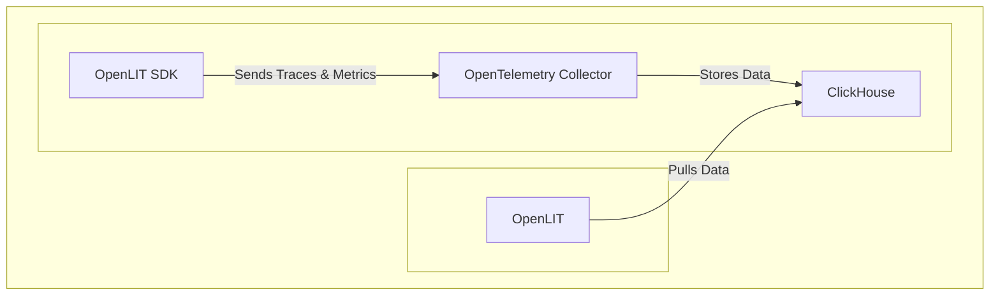

<div align="center">

</div>

# OpenLIT: The Open Source Platform for AI Engineering

**Simplify your AI development workflow with OpenLIT, offering observability, evaluations, guardrails, prompt management, a secure vault, and a user-friendly playground.**  This platform empowers AI engineers to build, monitor, and optimize their applications.  [Explore the OpenLIT project on GitHub](https://github.com/openlit/openlit).

**Key Features:**

*   📈 **AI Application Monitoring:** Gain deep insights into your AI application's performance with interactive dashboards tracking key metrics, costs, and user interactions.
*   🔌 **OpenTelemetry Observability:** Integrate seamlessly with your existing observability tools using vendor-neutral SDKs for comprehensive tracing and metric collection.
*   💲 **Cost Tracking:** Accurately estimate and manage costs for custom and fine-tuned models with customizable pricing.
*   🐛 **Exception Monitoring:** Quickly identify and resolve issues with a dedicated dashboard that tracks common exceptions and errors.
*   💭 **Prompt Management:** Organize and version prompts using Prompt Hub for consistent access and improved application management.
*   🔑 **API Key Security:** Securely manage API keys and secrets to avoid vulnerabilities.
*   🎮 **LLM Experimentation:** Easily test and compare various LLMs.

**Quick Links:**

*   [Documentation](https://docs.openlit.io/)
*   [Quickstart](-getting-started-with-llm-observability)
*   [Python SDK](https://github.com/openlit/openlit/tree/main/sdk/python)
*   [Typescript SDK](https://github.com/openlit/openlit/tree/main/sdk/typescript)
*   [Roadmap](#️-roadmap)
*   [Feature Request](https://github.com/openlit/openlit/issues/new?assignees=&labels=%3Araised_hand%3A+Up+for+Grabs%2C+%3Arocket%3A+Feature&projects=&template=feature-request.md&title=%5BFeat%5D%3A)
*   [Report a Bug](https://github.com/openlit/openlit/issues/new?assignees=&labels=%3Abug%3A+Bug%2C+%3Araised_hand%3A+Up+for+Grabs&projects=&template=bug.md&title=%5BBug%5D%3A)

[](https://openlit.io/)
[](https://github.com/openlit/openlit/blob/main/LICENSE)
[](https://pepy.tech/project/openlit)
[](https://github.com/openlit/openlit/pulse)
[](https://github.com/openlit/openlit/graphs/contributors)

[](https://join.slack.com/t/openlit/shared_invite/zt-2etnfttwg-TjP_7BZXfYg84oAukY8QRQ)
[](https://twitter.com/openlit_io)

---

**OpenLIT** simplifies AI development, especially for Generative AI and LLMs. It streamlines essential tasks like experimenting with LLMs, organizing and versioning prompts, and securely handling API keys. Enable **OpenTelemetry-native** observability with a single line of code, gaining full-stack monitoring. Build AI features and applications with confidence, smoothly transitioning from testing to production.

This project proudly follows and maintains the [Semantic Conventions](https://github.com/open-telemetry/semantic-conventions/tree/main/docs/gen-ai) with the OpenTelemetry community, consistently updating to align with the latest standards in Observability.

## 🚀 Getting Started with LLM Observability



### Step 1: Deploy OpenLIT Stack

1.  **Clone the Repository**

    ```shell
    git clone git@github.com:openlit/openlit.git
    ```

2.  **Self-host using Docker**

    ```shell
    docker compose up -d
    ```

    > For Kubernetes installation instructions with Helm, see the [Kubernetes Helm installation guide](https://docs.openlit.io/latest/installation#kubernetes).

### Step 2: Install OpenLIT SDK

```bash
pip install openlit
```

>  See the [TypeScript SDK Installation guide](https://github.com/openlit/openlit/tree/main/sdk/typescript#-installation) for TypeScript instructions.

### Step 3: Initialize OpenLIT in your Application

Add the following lines to your code to integrate OpenLIT.

```python
import openlit

openlit.init()
```

Configure telemetry data destination:

| Purpose                            | Parameter/Environment Variable                   | For Sending to OpenLIT    |
| ---------------------------------- | ------------------------------------------------ | ------------------------- |
| Send data to an HTTP OTLP endpoint | `otlp_endpoint` or `OTEL_EXPORTER_OTLP_ENDPOINT` | `"http://127.0.0.1:4318"` |
| Authenticate telemetry backends    | `otlp_headers` or `OTEL_EXPORTER_OTLP_HEADERS`   | Not required by default   |

> 💡 **Tip:**  If `otlp_endpoint` or `OTEL_EXPORTER_OTLP_ENDPOINT` is not provided, the SDK will output traces to your console, which is suitable for development.

#### Example

---

<details>
  <summary>Initialize using Function Arguments</summary>

  Add the following to your application code:

  ```python
  import openlit

  openlit.init(
    otlp_endpoint="http://127.0.0.1:4318",
  )
  ```
</details>

---

<details>
  <summary>Initialize using Environment Variables</summary>

  Add the following lines:

  ```python
  import openlit

  openlit.init()
  ```

  Then, configure the OTLP endpoint using an environment variable:

  ```env
  export OTEL_EXPORTER_OTLP_ENDPOINT = "http://127.0.0.1:4318"
  ```
</details>

---

### Step 4: Visualize and Optimize

Use the OpenLIT UI, available at `127.0.0.1:3000`, to visualize and analyze your data.

*   **Login:**  `user@openlit.io` / `openlituser`


## 🛣️ Roadmap

OpenLIT is constantly evolving.  Here's a look at past achievements and upcoming features:

| Feature                                                                                                                           | Status        |
| --------------------------------------------------------------------------------------------------------------------------------- | ------------- |
| [OpenTelemetry-native Observability SDK for Tracing and Metrics](https://github.com/openlit/openlit/tree/text-upgrade/sdk/python) | ✅ Completed   |
| [OpenTelemetry-native GPU Monitoring](https://docs.openlit.io/latest/features/gpu)                                                | ✅ Completed   |
| [Exceptions and Error Monitoring](https://docs.openlit.io/latest/features/exceptions)                                             | ✅ Completed   |
| [Prompt Hub for Managing and Versioning Prompts](https://docs.openlit.io/latest/features/prompt-hub)                              | ✅ Completed   |
| [OpenGround for Testing and Comparing LLMs](https://docs.openlit.io/latest/features/openground)                                   | ✅ Completed   |
| [Vault for Central Management of LLM API Keys and Secrets](https://docs.openlit.io/latest/features/vault)                         | ✅ Completed   |
| [Cost Tracking for Custom Models](https://docs.openlit.io/latest/features/pricing)                                                | ✅ Completed   |
| [Real-Time Guardrails Implementation](https://docs.openlit.io/latest/features/guardrails)                                         | ✅ Completed   |
| [Programmatic Evaluation for LLM Response](https://docs.openlit.io/latest/features/evaluations)                                   | ✅ Completed   |
| [Auto-Evaluation Metrics Based on Usage](https://github.com/openlit/openlit/issues/470)                                           | 🔜 Coming Soon |
| [Human Feedback for LLM Events](https://github.com/openlit/openlit/issues/471)                                                    | 🔜 Coming Soon |
| [Dataset Generation Based on LLM Events](https://github.com/openlit/openlit/issues/472)                                           | 🔜 Coming Soon |
| [Search over Traces]()                                                                                                            | 🔜 Coming Soon |

## 🌱 Contributing

All contributions are welcome.  See our [Contribution guide](./CONTRIBUTING.md) to get started.

Need help?  Here's how you can get involved:

*   Join our [Slack](https://join.slack.com/t/openlit/shared_invite/zt-2etnfttwg-TjP_7BZXfYg84oAukY8QRQ) or [Discord](https://discord.gg/rjvTm6zd) community.

## 💚 Community & Support

Connect with the OpenLIT community:

*   🌟 Star us on [GitHub](https://github.com/openlit/openlit).
*   🌍 Join our [Slack](https://join.slack.com/t/openlit/shared_invite/zt-2etnfttwg-TjP_7BZXfYg84oAukY8QRQ) or [Discord](https://discord.gg/CQnXwNT3) for discussions.
*   🐞 Report bugs on our [GitHub Issues](https://github.com/openlit/openlit/issues).
*   𝕏 Follow us on [X](https://twitter.com/openlit_io).

## License

OpenLIT is licensed under the [Apache-2.0 license](LICENSE).

## 🙇‍♂️ Acknowledgments

<p>This project is proudly supported by:</p>
<p>
  <a href="https://www.digitalocean.com/">
    
  </a>
</p>