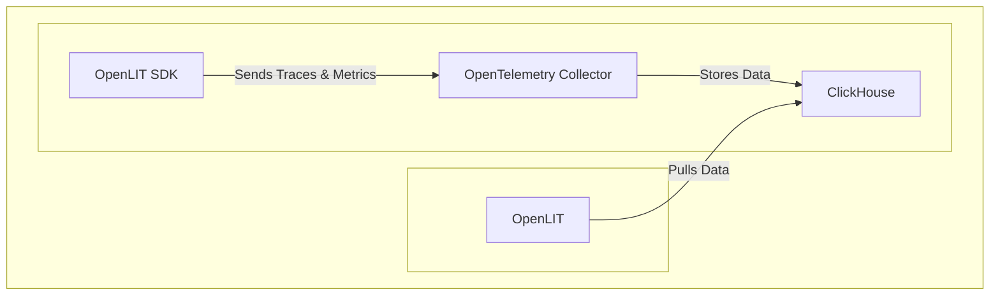

<div align="center">

</div>

# OpenLIT: Supercharge Your AI Engineering with Observability, Evaluations, and More

OpenLIT is your all-in-one open-source platform designed to streamline AI development and LLM (Large Language Model) applications.  Get started with OpenLIT on [GitHub](https://github.com/openlit/openlit)!

**Key Features:**

*   **Observability:** Gain full-stack visibility into your AI applications with OpenTelemetry-native observability, including LLMs, vector databases, and GPUs.
*   **Evaluations:** Programmatically evaluate LLM responses and measure performance.
*   **Guardrails:** Implement real-time guardrails to ensure responsible and safe AI deployments.
*   **Prompt Management:** Organize and version prompts using Prompt Hub for consistency.
*   **LLM Experimentation:** Easily test and compare different LLMs side-by-side with OpenGround.
*   **Secure Secrets Management:**  Safely manage API keys and secrets.

**[Documentation](https://docs.openlit.io/) | [Quickstart](-getting-started-with-llm-observability) | [Python SDK](https://github.com/openlit/openlit/tree/main/sdk/python) | [Typescript SDK](https://github.com/openlit/openlit/tree/main/sdk/typescript) |**

**[Roadmap](#️-roadmap) | [Feature Request](https://github.com/openlit/openlit/issues/new?assignees=&labels=%3Araised_hand%3A+Up+for+Grabs%2C+%3Arocket%3A+Feature&projects=&template=feature-request.md&title=%5BFeat%5D%3A) | [Report a Bug](https://github.com/openlit/openlit/issues/new?assignees=&labels=%3Abug%3A+Bug%2C+%3Araised_hand%3A+Up+for+Grabs&projects=&template=bug.md&title=%5BBug%5D%3A)**

[](https://openlit.io/)
[](https://github.com/openlit/openlit/blob/main/LICENSE)
[](https://pepy.tech/project/openlit)
[](https://github.com/openlit/openlit/pulse)
[](https://github.com/openlit/openlit/graphs/contributors)

[](https://join.slack.com/t/openlit/shared_invite/zt-2etnfttwg-TjP_7BZXfYg84oAukY8QRQ)
[](https://twitter.com/openlit_io)

---

## Why Choose OpenLIT?

OpenLIT simplifies your AI development workflow, making it easier to build, monitor, and optimize your AI applications. It provides tools for essential tasks like prompt versioning, LLM experimentation, and secure API key management, all while providing crucial observability with OpenTelemetry, enabling seamless transitions from testing to production.

## ⚡ Features


*   📈 **Analytics Dashboard:** Monitor your AI application's health and performance with detailed dashboards that track metrics, costs, and user interactions.
*   🔌 **OpenTelemetry-native Observability SDKs:** Vendor-neutral SDKs to send traces and metrics to your existing observability tools.
*   💲 **Cost Tracking:** Accurately estimate costs for custom and fine-tuned models.
*   🐛 **Exceptions Monitoring:** Quickly identify and resolve issues using a dedicated monitoring dashboard.
*   💭 **Prompt Management:**  Manage and version prompts using Prompt Hub.
*   🔑 **API Key Management:** Securely handle API keys and secrets.
*   🎮 **LLM Experimentation:** Explore, test, and compare various LLMs.

## 🚀 Getting Started with LLM Observability



### Step 1: Deploy OpenLIT Stack

1.  **Clone the Repository:**

    ```shell
    git clone git@github.com:openlit/openlit.git
    ```

2.  **Self-host with Docker:**

    ```shell
    docker compose up -d
    ```

    > For Kubernetes Helm installation, refer to the [Kubernetes Helm installation guide](https://docs.openlit.io/latest/installation#kubernetes).

### Step 2: Install OpenLIT SDK

```bash
pip install openlit
```

>  For the TypeScript SDK, visit the [TypeScript SDK Installation guide](https://github.com/openlit/openlit/tree/main/sdk/typescript#-installation).

### Step 3: Initialize in your Application

Add these lines to your AI application code:

```python
import openlit

openlit.init()
```

Configure the telemetry data destination:

| Purpose                            | Parameter/Environment Variable                   | For Sending to OpenLIT    |
| ---------------------------------- | ------------------------------------------------ | ------------------------- |
| Send data to an HTTP OTLP endpoint | `otlp_endpoint` or `OTEL_EXPORTER_OTLP_ENDPOINT` | `"http://127.0.0.1:4318"` |
| Authenticate telemetry backends    | `otlp_headers` or `OTEL_EXPORTER_OTLP_HEADERS`   | Not required by default   |

> 💡 **Tip:**  If `otlp_endpoint` is not provided, the SDK outputs traces to your console (recommended for development).

#### Example

---

<details>
  <summary>Initialize using Function Arguments</summary>

  Add the following two lines to your application code:

  ```python
  import openlit

  openlit.init(
    otlp_endpoint="http://127.0.0.1:4318",
  )
  ```

</details>

---

<details>

  ---

  <summary>Initialize using Environment Variables</summary>

  Add the following two lines to your application code:

  ```python
  import openlit

  openlit.init()
  ```

  Then, configure the your OTLP endpoint using environment variable:

  ```env
  export OTEL_EXPORTER_OTLP_ENDPOINT = "http://127.0.0.1:4318"
  ```

</details>

---

### Step 4: Visualize and Optimize

Access the OpenLIT dashboard at `127.0.0.1:3000` using the default credentials:

*   **Email**: `user@openlit.io`
*   **Password**: `openlituser`


## 🛣️ Roadmap

| Feature                                                                                                                           | Status        |
| --------------------------------------------------------------------------------------------------------------------------------- | ------------- |
| [OpenTelemetry-native Observability SDK for Tracing and Metrics](https://github.com/openlit/openlit/tree/text-upgrade/sdk/python) | ✅ Completed   |
| [OpenTelemetry-native GPU Monitoring](https://docs.openlit.io/latest/features/gpu)                                                | ✅ Completed   |
| [Exceptions and Error Monitoring](https://docs.openlit.io/latest/features/exceptions)                                             | ✅ Completed   |
| [Prompt Hub for Managing and Versioning Prompts](https://docs.openlit.io/latest/features/prompt-hub)                              | ✅ Completed   |
| [OpenGround for Testing and Comparing LLMs](https://docs.openlit.io/latest/features/openground)                                   | ✅ Completed   |
| [Vault for Central Management of LLM API Keys and Secrets](https://docs.openlit.io/latest/features/vault)                         | ✅ Completed   |
| [Cost Tracking for Custom Models](https://docs.openlit.io/latest/features/pricing)                                                | ✅ Completed   |
| [Real-Time Guardrails Implementation](https://docs.openlit.io/latest/features/guardrails)                                         | ✅ Completed   |
| [Programmatic Evaluation for LLM Response](https://docs.openlit.io/latest/features/evaluations)                                   | ✅ Completed   |
| [Auto-Evaluation Metrics Based on Usage](https://github.com/openlit/openlit/issues/470)                                           | 🔜 Coming Soon |
| [Human Feedback for LLM Events](https://github.com/openlit/openlit/issues/471)                                                    | 🔜 Coming Soon |
| [Dataset Generation Based on LLM Events](https://github.com/openlit/openlit/issues/472)                                           | 🔜 Coming Soon |
| [Search over Traces]()                                                                                                            | 🔜 Coming Soon |

## 🌱 Contributing

We welcome all contributions!  See our [Contribution guide](./CONTRIBUTING.md) to get started.  Here are a few ways to get involved:

*   Join our [Slack](https://join.slack.com/t/openlit/shared_invite/zt-2etnfttwg-TjP_7BZXfYg84oAukY8QRQ) or [Discord](https://discord.gg/rjvTm6zd) communities.

[](https://www.producthunt.com/posts/openlit?embed=true&utm_source=badge-featured&utm_medium=badge&utm_souce=badge-openlit)
<a href="https://fazier.com/launches/openlit-2" target="_blank" rel="noopener noreferrer"></a>

## 💚 Community & Support

*   🌟 Give us a star on [GitHub](https://github.com/openlit/openlit/).
*   🌍 Join our [Slack](https://join.slack.com/t/openlit/shared_invite/zt-2etnfttwg-TjP_7BZXfYg84oAukY8QRQ) or [Discord](https://discord.gg/CQnXwNT3) for live support.
*   🐞 Report bugs on [GitHub Issues](https://github.com/openlit/openlit/issues).
*   𝕏 Follow us on [X](https://twitter.com/openlit_io).

## License

OpenLIT is licensed under the [Apache-2.0 license](LICENSE).

## 🙇‍♂️ Acknowledgments

<p>This project is proudly supported by:</p>
<p>
  <a href="https://www.digitalocean.com/">
    
  </a>
</p>
```
Key improvements and explanations:

*   **SEO-Optimized Title and Introduction:**  The title includes relevant keywords (e.g., "AI Engineering," "Observability," "LLMs"). The introduction emphasizes the core value proposition.
*   **Concise One-Sentence Hook:** A clear and compelling opening line that immediately grabs the reader's attention.
*   **Clear Headings:**  Uses proper Markdown headings (H1, H2, H3) for structure and readability, making it easier for users and search engines to understand the content.
*   **Bulleted Key Features:** Uses bullet points to highlight the main functionalities of OpenLIT.
*   **Actionable Steps:** Provides a clear "Getting Started" guide with numbered steps, commands, and code snippets.
*   **Important notes and tips:** Highlighted important information to enhance user experience.
*   **Roadmap and Community:** Clearly outlines the roadmap and how users can contribute to the project and get support.
*   **Contextual Links:** Links are integrated naturally within the text.
*   **Complete Structure:**  Maintains all the original content while improving its presentation and clarity.  The order of sections is logical.
*   **Concise language:** Edited out redundant phrases and streamlined sentences.
*   **Keyword Density:**  Maintained a healthy keyword density without keyword stuffing.
*   **Visuals Maintained**: Images and badges were not removed, so the updated README keeps the original feel.