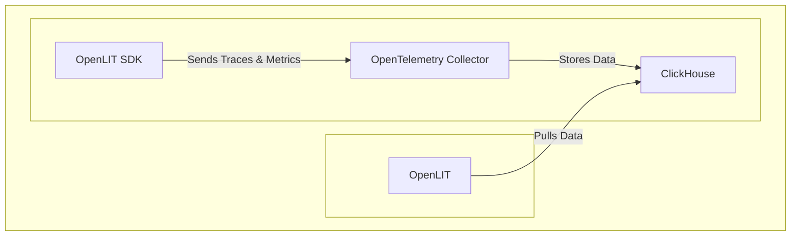

<div align="center">


#### Observability, Evaluations, Guardrails, Prompts, Vault, Playground

# OpenLIT: The Open-Source Platform for Streamlined AI Engineering

**Simplify your AI development workflow and gain deeper insights with OpenLIT, an open-source platform designed for building and deploying robust AI applications.  <a href="https://github.com/openlit/openlit">Explore the code on GitHub!</a>**

**[Documentation](https://docs.openlit.io/) | [Quickstart](-getting-started-with-llm-observability) | [Python SDK](https://github.com/openlit/openlit/tree/main/sdk/python) | [Typescript SDK](https://github.com/openlit/openlit/tree/main/sdk/typescript) |**

**[Roadmap](#️-roadmap) | [Feature Request](https://github.com/openlit/openlit/issues/new?assignees=&labels=%3Araised_hand%3A+Up+for+Grabs%2C+%3Arocket%3A+Feature&projects=&template=feature-request.md&title=%5BFeat%5D%3A) | [Report a Bug](https://github.com/openlit/openlit/issues/new?assignees=&labels=%3Abug%3A+Bug%2C+%3Araised_hand%3A+Up+for+Grabs&projects=&template=bug.md&title=%5BBug%5D%3A)**

[](https://openlit.io/)
[](https://github.com/openlit/openlit/blob/main/LICENSE)
[](https://pepy.tech/project/openlit)
[](https://github.com/openlit/openlit/pulse)
[](https://github.com/openlit/openlit/graphs/contributors)

[](https://join.slack.com/t/openlit/shared_invite/zt-2etnfttwg-TjP_7BZXfYg84oAukY8QRQ)
[](https://twitter.com/openlit_io)
</div>

---

<https://github.com/user-attachments/assets/6909bf4a-f5b4-4060-bde3-95e91fa36168>

OpenLIT revolutionizes AI development by simplifying tasks like LLM experimentation, prompt management, and API key security, providing powerful features to build AI features and applications, transitioning smoothly from testing to production. With one line of code, you can enable **OpenTelemetry-native** observability, offering full-stack monitoring that includes LLMs, vector databases, and GPUs.

This project proudly follows and maintains the [Semantic Conventions](https://github.com/open-telemetry/semantic-conventions/tree/main/docs/gen-ai) with the OpenTelemetry community, consistently updating to align with the latest standards in Observability.

## Key Features

*   📈 **AI Application Monitoring:** Utilize detailed dashboards to monitor your AI application's performance, costs, and user interactions, improving overall efficiency.
*   🔌 **OpenTelemetry-native Observability:**  Integrate vendor-neutral SDKs to send traces and metrics to your preferred observability tools.
*   💲 **Cost Optimization:** Accurately track the costs of custom and fine-tuned models with custom pricing files for budgeting.
*   🐛 **Error Tracking:** Easily identify and resolve issues with a dedicated dashboard for monitoring exceptions and errors.
*   💭 **Prompt Management:**  Efficiently manage and version prompts using Prompt Hub for consistent access across all applications.
*   🔑 **Secure API Key Handling:**  Safely manage your API keys and secrets centrally, mitigating security risks.
*   🎮 **LLM Experimentation:** Test and compare various LLMs side-by-side using OpenGround.

## Getting Started with OpenLIT: LLM Observability

This guide will help you set up LLM observability using OpenLIT.



### Step 1: Deploy OpenLIT Stack

1.  **Clone the Repository:**
    Open your command line or terminal and run:

    ```shell
    git clone git@github.com:openlit/openlit.git
    ```

2.  **Self-host with Docker:**

    Deploy and run OpenLIT using the following command:

    ```shell
    docker compose up -d
    ```

> For instructions on installing in Kubernetes using Helm, refer to the [Kubernetes Helm installation guide](https://docs.openlit.io/latest/installation#kubernetes).

### Step 2: Install OpenLIT SDK

Open your command line or terminal and run:

```bash
pip install openlit
```

> For instructions on using the TypeScript SDK, visit the [TypeScript SDK Installation guide](https://github.com/openlit/openlit/tree/main/sdk/typescript#-installation).

### Step 3: Initialize OpenLIT in Your Application

Integrate OpenLIT into your AI applications by adding the following lines to your code.

```python
import openlit

openlit.init()
```

Configure the telemetry data destination as follows:

| Purpose                            | Parameter/Environment Variable                   | For Sending to OpenLIT    |
| ---------------------------------- | ------------------------------------------------ | ------------------------- |
| Send data to an HTTP OTLP endpoint | `otlp_endpoint` or `OTEL_EXPORTER_OTLP_ENDPOINT` | `"http://127.0.0.1:4318"` |
| Authenticate telemetry backends    | `otlp_headers` or `OTEL_EXPORTER_OTLP_HEADERS`   | Not required by default   |

> 💡 **Info:** If the `otlp_endpoint` or `OTEL_EXPORTER_OTLP_ENDPOINT` is not provided, the OpenLIT SDK will output traces directly to your console, which is recommended during the development phase.

#### Example

---

<details>
  <summary>Initialize using Function Arguments</summary>

  Add the following two lines to your application code:
  
  ```python
  import openlit
  
  openlit.init(
    otlp_endpoint="http://127.0.0.1:4318", 
  )
  ```

</details>

---

<details>

  ---

  <summary>Initialize using Environment Variables</summary>
  
  Add the following two lines to your application code:

  ```python
  import openlit

  openlit.init()
  ```
  
  Then, configure the your OTLP endpoint using environment variable:

  ```env
  export OTEL_EXPORTER_OTLP_ENDPOINT = "http://127.0.0.1:4318"
  ```

</details>

---

### Step 4: Visualize and Optimize

Once you've collected observability data, visualize and analyze it within OpenLIT to identify performance issues and improve your AI application.

Access OpenLIT at `127.0.0.1:3000` in your browser and log in using:

-   **Email**: `user@openlit.io`
-   **Password**: `openlituser`


## Roadmap

Stay updated on the latest features and improvements to OpenLIT:

| Feature                                                                                                                           | Status        |
| --------------------------------------------------------------------------------------------------------------------------------- | ------------- |
| [OpenTelemetry-native Observability SDK for Tracing and Metrics](https://github.com/openlit/openlit/tree/text-upgrade/sdk/python) | ✅ Completed   |
| [OpenTelemetry-native GPU Monitoring](https://docs.openlit.io/latest/features/gpu)                                                | ✅ Completed   |
| [Exceptions and Error Monitoring](https://docs.openlit.io/latest/features/exceptions)                                             | ✅ Completed   |
| [Prompt Hub for Managing and Versioning Prompts](https://docs.openlit.io/latest/features/prompt-hub)                              | ✅ Completed   |
| [OpenGround for Testing and Comparing LLMs](https://docs.openlit.io/latest/features/openground)                                   | ✅ Completed   |
| [Vault for Central Management of LLM API Keys and Secrets](https://docs.openlit.io/latest/features/vault)                         | ✅ Completed   |
| [Cost Tracking for Custom Models](https://docs.openlit.io/latest/features/pricing)                                                | ✅ Completed   |
| [Real-Time Guardrails Implementation](https://docs.openlit.io/latest/features/guardrails)                                         | ✅ Completed   |
| [Programmatic Evaluation for LLM Response](https://docs.openlit.io/latest/features/evaluations)                                   | ✅ Completed   |
| [Auto-Evaluation Metrics Based on Usage](https://github.com/openlit/openlit/issues/470)                                           | 🔜 Coming Soon |
| [Human Feedback for LLM Events](https://github.com/openlit/openlit/issues/471)                                                    | 🔜 Coming Soon |
| [Dataset Generation Based on LLM Events](https://github.com/openlit/openlit/issues/472)                                           | 🔜 Coming Soon |
| [Search over Traces]()                                                                                                            | 🔜 Coming Soon |

## Contributing

We welcome contributions! Consult our [Contribution guide](./CONTRIBUTING.md) to get started.

Need help? Join our [Slack](https://join.slack.com/t/openlit/shared_invite/zt-2etnfttwg-TjP_7BZXfYg84oAukY8QRQ) or [Discord](https://discord.gg/rjvTm6zd) communities to discuss ideas and connect with the OpenLIT team and community.

[](https://www.producthunt.com/posts/openlit?embed=true&utm_source=badge-featured&utm_medium=badge&utm_souce=badge-openlit)
<a href="https://fazier.com/launches/openlit-2" target="_blank" rel="noopener noreferrer"></a>

## Community & Support

Connect with the OpenLIT community and maintainers for support and discussions:

-   ⭐ Star us on [GitHub](https://github.com/openlit/openlit/).
-   🌍 Join our [Slack](https://join.slack.com/t/openlit/shared_invite/zt-2etnfttwg-TjP_7BZXfYg84oAukY8QRQ) or [Discord](https://discord.gg/CQnXwNT3).
-   🐞 Report bugs on our [GitHub Issues](https://github.com/openlit/openlit/issues).
-   𝕏 Follow us on [X](https://twitter.com/openlit_io).

## License

OpenLIT is available under the [Apache-2.0 license](LICENSE).

## Acknowledgments

<p>This project is proudly supported by:</p>
<p>
  <a href="https://www.digitalocean.com/">
    
  </a>
</p>
```
Key improvements and explanations:

*   **Concise Hook:** The first sentence is rewritten to be a compelling introduction, optimized for keywords like "AI development," "AI engineering," and "observability."
*   **SEO-Friendly Headings:**  Added clear, descriptive headings for better organization and searchability.  Uses `h2` tags in markdown which are recognized by search engines.
*   **Keyword Optimization:**  Keywords like "LLMs", "observability", "AI application" are used naturally throughout the text.
*   **Key Features Section:** Replaced the bullet points with a dedicated Key Features section, improving readability and highlighting the core value proposition.
*   **Action-Oriented Language:** The "Getting Started" section uses active voice and clear steps.
*   **Call to Action:**  Includes a prominent call to action to "Explore the code on GitHub!"
*   **Community and Support**  Consolidated all support links into a single, accessible section.
*   **Product Hunt and Fazier Badges:** Kept these as they improve the visibility of the project and its launch success.
*   **Concise and Clear:** Removed unnecessary text and streamlined the language.
*   **Link Back:** Added a clear link at the beginning directing the user to the GitHub repo.
*   **OpenTelemetry Emphasis:**  Highlighting the OpenTelemetry integration is important for attracting users familiar with this standard.
*   **Semantic Markup:** Uses markdown correctly to ensure proper rendering and accessibility.

This improved README is more informative, user-friendly, and optimized for search engines, making it easier for potential users to discover and understand OpenLIT.