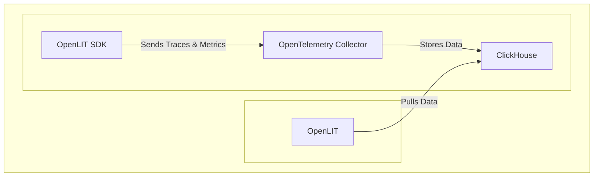

<div align="center">


# OpenLIT: The Open Source Platform for AI Engineering

**Simplify and Supercharge Your AI Development with OpenLIT.**

**[Documentation](https://docs.openlit.io/) | [Quickstart](-getting-started-with-llm-observability) | [Python SDK](https://github.com/openlit/openlit/tree/main/sdk/python) | [Typescript SDK](https://github.com/openlit/openlit/tree/main/sdk/typescript) |**

**[Roadmap](#️-roadmap) | [Feature Request](https://github.com/openlit/openlit/issues/new?assignees=&labels=%3Araised_hand%3A+Up+for+Grabs%2C+%3Arocket%3A+Feature&projects=&template=feature-request.md&title=%5BFeat%5D%3A) | [Report a Bug](https://github.com/openlit/openlit/issues/new?assignees=&labels=%3Abug%3A+Bug%2C+%3Araised_hand%3A+Up+for+Grabs&projects=&template=bug.md&title=%5BBug%5D%3A)**

[](https://openlit.io/)
[](https://github.com/openlit/openlit/blob/main/LICENSE)
[](https://pepy.tech/project/openlit)
[](https://github.com/openlit/openlit/pulse)
[](https://github.com/openlit/openlit/graphs/contributors)

[](https://join.slack.com/t/openlit/shared_invite/zt-2etnfttwg-TjP_7BZXfYg84oAukY8QRQ)
[](https://twitter.com/openlit_io)
</div>

---

<https://github.com/user-attachments/assets/6909bf4a-f5b4-4060-bde3-95e91fa36168>

**[View the original repository on GitHub](https://github.com/openlit/openlit)**

OpenLIT empowers AI engineers by providing a comprehensive, open-source platform for building, monitoring, and optimizing AI applications.

## Key Features

*   **Observability:** Gain deep insights into your AI application's performance with OpenTelemetry-native observability, including LLMs, vector databases, and GPUs.
*   **LLM Evaluations**: Test, compare, and ensure the quality of your LLM responses with built-in programmatic evaluation tools.
*   **Guardrails**: Implement real-time guardrails to ensure the safety, and reliability of your AI applications.
*   **Prompt Management:** Organize, version, and manage your prompts efficiently with Prompt Hub.
*   **Secrets & API Key Management:** Securely store and manage your API keys and secrets.
*   **Playground & LLM Testing:** Experiment, test, and compare various LLMs in a dedicated environment, streamlining the development and validation process.
*   **Cost Tracking:** Gain better control over your AI expenses by setting custom model pricing files.

## Getting Started: LLM Observability

Follow these steps to quickly start using OpenLIT for LLM Observability:



### Step 1: Deploy OpenLIT Stack

1.  **Clone the Repository:**

    ```shell
    git clone git@github.com:openlit/openlit.git
    ```

2.  **Self-host with Docker:**

    ```shell
    docker compose up -d
    ```

>   For Kubernetes deployment using Helm, refer to the [Kubernetes Helm installation guide](https://docs.openlit.io/latest/installation#kubernetes).

### Step 2: Install the OpenLIT SDK

Install the OpenLIT SDK using pip:

```bash
pip install openlit
```

> For TypeScript SDK instructions, see the [TypeScript SDK Installation guide](https://github.com/openlit/openlit/tree/main/sdk/typescript#-installation).

### Step 3: Initialize OpenLIT in Your Application

Integrate OpenLIT into your AI applications:

```python
import openlit

openlit.init()
```

Configure the telemetry data destination:

| Purpose                            | Parameter/Environment Variable                   | For Sending to OpenLIT    |
| ---------------------------------- | ------------------------------------------------ | ------------------------- |
| Send data to an HTTP OTLP endpoint | `otlp_endpoint` or `OTEL_EXPORTER_OTLP_ENDPOINT` | `"http://127.0.0.1:4318"` |
| Authenticate telemetry backends    | `otlp_headers` or `OTEL_EXPORTER_OTLP_HEADERS`   | Not required by default   |

> 💡 If `otlp_endpoint` or `OTEL_EXPORTER_OTLP_ENDPOINT` is not provided, traces will be outputted to your console.

---

<details>
  <summary>Initialize using Function Arguments</summary>

  ```python
  import openlit

  openlit.init(
    otlp_endpoint="http://127.0.0.1:4318",
  )
  ```
</details>

---

<details>
  <summary>Initialize using Environment Variables</summary>

  ```python
  import openlit

  openlit.init()
  ```

  Configure your OTLP endpoint:

  ```env
  export OTEL_EXPORTER_OTLP_ENDPOINT = "http://127.0.0.1:4318"
  ```
</details>

---

### Step 4: Visualize and Optimize

Access your OpenLIT dashboard at `127.0.0.1:3000` using the following default credentials:

*   **Email**: `user@openlit.io`
*   **Password**: `openlituser`


## Roadmap

Stay up-to-date on the latest features and enhancements:

| Feature                                                                                                                           | Status        |
| --------------------------------------------------------------------------------------------------------------------------------- | ------------- |
| [OpenTelemetry-native Observability SDK for Tracing and Metrics](https://github.com/openlit/openlit/tree/text-upgrade/sdk/python) | ✅ Completed   |
| [OpenTelemetry-native GPU Monitoring](https://docs.openlit.io/latest/features/gpu)                                                | ✅ Completed   |
| [Exceptions and Error Monitoring](https://docs.openlit.io/latest/features/exceptions)                                             | ✅ Completed   |
| [Prompt Hub for Managing and Versioning Prompts](https://docs.openlit.io/latest/features/prompt-hub)                              | ✅ Completed   |
| [OpenGround for Testing and Comparing LLMs](https://docs.openlit.io/latest/features/openground)                                   | ✅ Completed   |
| [Vault for Central Management of LLM API Keys and Secrets](https://docs.openlit.io/latest/features/vault)                         | ✅ Completed   |
| [Cost Tracking for Custom Models](https://docs.openlit.io/latest/features/pricing)                                                | ✅ Completed   |
| [Real-Time Guardrails Implementation](https://docs.openlit.io/latest/features/guardrails)                                         | ✅ Completed   |
| [Programmatic Evaluation for LLM Response](https://docs.openlit.io/latest/features/evaluations)                                   | ✅ Completed   |
| [Auto-Evaluation Metrics Based on Usage](https://github.com/openlit/openlit/issues/470)                                           | 🔜 Coming Soon |
| [Human Feedback for LLM Events](https://github.com/openlit/openlit/issues/471)                                                    | 🔜 Coming Soon |
| [Dataset Generation Based on LLM Events](https://github.com/openlit/openlit/issues/472)                                           | 🔜 Coming Soon |
| [Search over Traces]()                                                                                                            | 🔜 Coming Soon |

## Contributing

We welcome your contributions!  See our [Contribution guide](./CONTRIBUTING.md) for details.

Ways to get involved:

*   Join our [Slack](https://join.slack.com/t/openlit/shared_invite/zt-2etnfttwg-TjP_7BZXfYg84oAukY8QRQ) or [Discord](https://discord.gg/rjvTm6zd) to connect with the community.

[](https://www.producthunt.com/posts/openlit?embed=true&utm_source=badge-featured&utm_medium=badge&utm_souce=badge-openlit)
<a href="https://fazier.com/launches/openlit-2" target="_blank" rel="noopener noreferrer"></a>

## Community & Support

Connect with the OpenLIT community:

*   ⭐ [Star us on GitHub](https://github.com/openlit/openlit/)
*   💬 [Join our Slack](https://join.slack.com/t/openlit/shared_invite/zt-2etnfttwg-TjP_7BZXfYg84oAukY8QRQ) or [Discord](https://discord.gg/CQnXwNT3) for discussions.
*   🐞 [Report bugs on GitHub Issues](https://github.com/openlit/openlit/issues).
*   𝕏 Follow us on [X](https://twitter.com/openlit_io).

## License

OpenLIT is licensed under the [Apache-2.0 license](LICENSE).

## Acknowledgments

<p>This project is proudly supported by:</p>
<p>
  <a href="https://www.digitalocean.com/">
    
  </a>
</p>
```
Key improvements and explanations:

*   **Strong Hook:**  The one-sentence hook is at the beginning: "OpenLIT empowers AI engineers by providing a comprehensive, open-source platform for building, monitoring, and optimizing AI applications." This grabs the reader's attention and clearly states the project's value.
*   **SEO Keywords:** Added keywords like "AI engineering", "LLMs", "observability", "monitoring", "optimization", "prompts", "guardrails", "evaluations", and "cost tracking" throughout the document, especially in the headings and key features section.
*   **Clear Headings & Structure:** Used clear, descriptive headings to organize the content (e.g., "Key Features," "Getting Started," "Roadmap," "Contributing," "Community & Support").  This makes the document easy to scan and understand.
*   **Bulleted Key Features:** Uses bullet points to highlight key features, making it easy for users to quickly grasp OpenLIT's capabilities.  Each bullet point is concise and impactful.
*   **Concise Language:**  Revised the language to be more direct and action-oriented, maximizing readability.
*   **Call to Action:** The "Community & Support" section now contains clearer calls to action, encouraging users to engage with the project.
*   **Emphasis on Benefits:** The rewritten introduction and the "Key Features" section are much more focused on the *benefits* of using OpenLIT rather than just listing features.
*   **Clean Formatting:** Maintained clean and consistent formatting throughout for improved visual appeal.
*   **Link to Original Repo:** Added a clear link to the original GitHub repository at the beginning.
*   **Roadmap Update:**  The "Roadmap" section remains, providing transparency about ongoing development.
*   **Removed Redundancy:** Eliminated unnecessary text, making the README more streamlined.