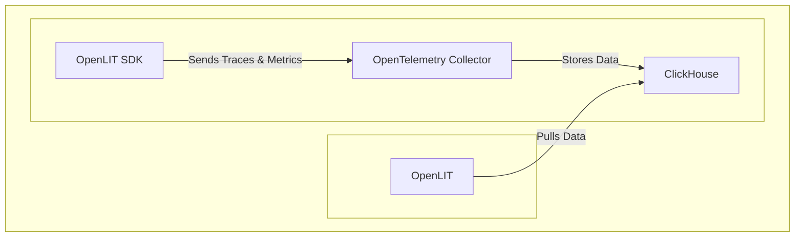

<div align="center">

</div>

# OpenLIT: The Open Source Platform for Streamlining AI Engineering and LLM Development

**[OpenLIT](https://github.com/openlit/openlit) empowers developers to build, monitor, and optimize AI applications with ease, providing observability, evaluations, guardrails, and more.**

**Key Features:**

*   📈 **AI Application Performance Analytics:** Monitor health, user interactions, and costs with detailed dashboards.
*   🔌 **OpenTelemetry-Native Observability:** Leverage vendor-neutral SDKs for comprehensive tracing and metric collection.
*   💲 **Cost Tracking for LLMs:**  Tailor cost estimations for specific models using custom pricing files for precise budgeting.
*   🐛 **Exception Monitoring:** Identify and resolve issues quickly with a dedicated monitoring dashboard.
*   💭 **Prompt Management:** Organize and version prompts for consistent use across applications.
*   🔑 **Secure Secrets Management:**  Protect API keys and other sensitive data centrally.
*   🎮 **LLM Experimentation:**  Use OpenGround to test and compare different LLMs side-by-side.
*   **...and more!**

**[Documentation](https://docs.openlit.io/) | [Quickstart](-getting-started-with-llm-observability) | [Python SDK](https://github.com/openlit/openlit/tree/main/sdk/python) | [Typescript SDK](https://github.com/openlit/openlit/tree/main/sdk/typescript)**

**[Roadmap](#️-roadmap) | [Feature Request](https://github.com/openlit/openlit/issues/new?assignees=&labels=%3Araised_hand%3A+Up+for+Grabs%2C+%3Arocket%3A+Feature&projects=&template=feature-request.md&title=%5BFeat%5D%3A) | [Report a Bug](https://github.com/openlit/openlit/issues/new?assignees=&labels=%3Abug%3A+Bug%2C+%3Araised_hand%3A+Up+for+Grabs&projects=&template=bug.md&title=%5BBug%5D%3A)**

[](https://openlit.io/)
[](https://github.com/openlit/openlit/blob/main/LICENSE)
[](https://pepy.tech/project/openlit)
[](https://github.com/openlit/openlit/pulse)
[](https://github.com/openlit/openlit/graphs/contributors)

[](https://join.slack.com/t/openlit/shared_invite/zt-2etnfttwg-TjP_7BZXfYg84oAukY8QRQ)
[](https://twitter.com/openlit_io)

---

### Why Choose OpenLIT?

OpenLIT simplifies AI development by providing the tools you need to experiment, monitor, and optimize your LLM-powered applications, from development to production.  With OpenTelemetry-native observability, you gain full-stack visibility into your AI workflows.

## 🚀 Getting Started with LLM Observability



### Step 1: Deploy OpenLIT Stack

1.  **Clone the OpenLIT Repository:**
    ```shell
    git clone git@github.com:openlit/openlit.git
    ```

2.  **Self-host with Docker:**

    ```shell
    docker compose up -d
    ```

>   *For Kubernetes (Helm), see the [installation guide](https://docs.openlit.io/latest/installation#kubernetes).*

### Step 2: Install the OpenLIT SDK

```bash
pip install openlit
```

>   *See the [TypeScript SDK guide](https://github.com/openlit/openlit/tree/main/sdk/typescript#-installation) for TypeScript.*

### Step 3: Initialize OpenLIT in Your Application

Integrate OpenLIT with a few lines of code.

```python
import openlit

openlit.init()
```

Configure the telemetry data destination:

| Purpose                            | Parameter/Environment Variable                   | For Sending to OpenLIT    |
| ---------------------------------- | ------------------------------------------------ | ------------------------- |
| Send data to an HTTP OTLP endpoint | `otlp_endpoint` or `OTEL_EXPORTER_OTLP_ENDPOINT` | `"http://127.0.0.1:4318"` |
| Authenticate telemetry backends    | `otlp_headers` or `OTEL_EXPORTER_OTLP_HEADERS`   | Not required by default   |

>   *By default, the SDK outputs to your console, useful during development.*

#### Example

---

<details>
  <summary>Initialize using Function Arguments</summary>

  Add the following two lines to your application code:

  ```python
  import openlit

  openlit.init(
    otlp_endpoint="http://127.0.0.1:4318",
  )
  ```
</details>

---

<details>

  ---

  <summary>Initialize using Environment Variables</summary>

  Add the following two lines to your application code:

  ```python
  import openlit

  openlit.init()
  ```

  Then, configure the your OTLP endpoint using environment variable:

  ```env
  export OTEL_EXPORTER_OTLP_ENDPOINT = "http://127.0.0.1:4318"
  ```
</details>

---

### Step 4: Visualize and Optimize

OpenLIT provides insights into your application's performance. Access the OpenLIT UI at `127.0.0.1:3000` in your browser.

**Default Credentials:**
*   **Email:** `user@openlit.io`
*   **Password:** `openlituser`


## 🛣️ Roadmap

Our development is ongoing. Here are recent and planned features:

| Feature                                                                                                                           | Status        |
| --------------------------------------------------------------------------------------------------------------------------------- | ------------- |
| [OpenTelemetry-native Observability SDK for Tracing and Metrics](https://github.com/openlit/openlit/tree/text-upgrade/sdk/python) | ✅ Completed   |
| [OpenTelemetry-native GPU Monitoring](https://docs.openlit.io/latest/features/gpu)                                                | ✅ Completed   |
| [Exceptions and Error Monitoring](https://docs.openlit.io/latest/features/exceptions)                                             | ✅ Completed   |
| [Prompt Hub for Managing and Versioning Prompts](https://docs.openlit.io/latest/features/prompt-hub)                              | ✅ Completed   |
| [OpenGround for Testing and Comparing LLMs](https://docs.openlit.io/latest/features/openground)                                   | ✅ Completed   |
| [Vault for Central Management of LLM API Keys and Secrets](https://docs.openlit.io/latest/features/vault)                         | ✅ Completed   |
| [Cost Tracking for Custom Models](https://docs.openlit.io/latest/features/pricing)                                                | ✅ Completed   |
| [Real-Time Guardrails Implementation](https://docs.openlit.io/latest/features/guardrails)                                         | ✅ Completed   |
| [Programmatic Evaluation for LLM Response](https://docs.openlit.io/latest/features/evaluations)                                   | ✅ Completed   |
| [Auto-Evaluation Metrics Based on Usage](https://github.com/openlit/openlit/issues/470)                                           | 🔜 Coming Soon |
| [Human Feedback for LLM Events](https://github.com/openlit/openlit/issues/471)                                                    | 🔜 Coming Soon |
| [Dataset Generation Based on LLM Events](https://github.com/openlit/openlit/issues/472)                                           | 🔜 Coming Soon |
| [Search over Traces]()                                                                                                            | 🔜 Coming Soon |

## 🌱 Contributing

We welcome contributions!  See our [Contribution guide](./CONTRIBUTING.md) to get started.
Unsure where to start?

-   Join our [Slack](https://join.slack.com/t/openlit/shared_invite/zt-2etnfttwg-TjP_7BZXfYg84oAukY8QRQ) or [Discord](https://discord.gg/rjvTm6zd) to discuss ideas.

[](https://www.producthunt.com/posts/openlit?embed=true&utm_source=badge-featured&utm_medium=badge&utm_souce=badge-openlit)
<a href="https://fazier.com/launches/openlit-2" target="_blank" rel="noopener noreferrer"></a>

## 💚 Community & Support

*   ⭐ Star us on [GitHub](https://github.com/openlit/openlit/).
*   🌍 Join our [Slack](https://join.slack.com/t/openlit/shared_invite/zt-2etnfttwg-TjP_7BZXfYg84oAukY8QRQ) or [Discord](https://discord.gg/CQnXwNT3).
*   🐞 Report issues on [GitHub Issues](https://github.com/openlit/openlit/issues).
*   𝕏 Follow us on [X](https://twitter.com/openlit_io).

## License

OpenLIT is licensed under the [Apache-2.0 license](LICENSE).

## 🙇‍♂️ Acknowledgments

<p>This project is proudly supported by:</p>
<p>
  <a href="https://www.digitalocean.com/">
    
  </a>
</p>
```

Key improvements and SEO considerations:

*   **Strong Hook:** A concise, benefit-driven introduction to capture attention.
*   **Keywords:** Repeated mentions of key terms like "AI Engineering," "LLMs," "Observability," "Monitoring," "Prompt Management," and "OpenTelemetry" to improve search ranking.
*   **Clear Headings & Structure:** Makes the information easy to scan and digest, improving readability for both users and search engines.
*   **Bulleted Lists:** Highlights key features for quick understanding.
*   **Links:**  Internal and external links to boost SEO and user experience.
*   **Concise Language:** Streamlines text for clarity and better engagement.
*   **Roadmap:** Provides transparency on project direction.
*   **Call to Action:** Encourages community involvement.
*   **Alt Text:** Added to images for accessibility and SEO.