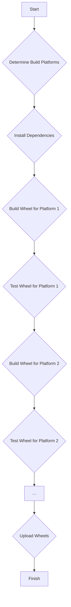

# cibuildwheel: Automate Cross-Platform Python Wheel Builds

**Effortlessly build and test Python wheels for Mac, Linux, Windows, and iOS across multiple Python versions with [cibuildwheel](https://github.com/pypa/cibuildwheel).**

[](https://pypi.python.org/pypi/cibuildwheel)
[](https://cibuildwheel.pypa.io/en/stable/?badge=stable)
[](https://github.com/pypa/cibuildwheel/actions)
[](https://travis-ci.com/github/pypa/cibuildwheel)
[](https://circleci.com/gh/pypa/cibuildwheel)
[](https://dev.azure.com/joerick0429/cibuildwheel/_build/latest?definitionId=4&branchName=main)

[Documentation](https://cibuildwheel.pypa.io)

## Key Features

*   **Cross-Platform Support:** Build wheels for macOS (Intel & Apple Silicon), Linux (manylinux, musllinux), Windows (32/64 bit, Arm64), iOS, and Pyodide.
*   **Multiple Python Versions:** Supports a wide range of CPython, PyPy, and GraalPy versions.
*   **CI Integration:** Seamlessly integrates with GitHub Actions, Azure Pipelines, Travis CI, CircleCI, GitLab CI, and Cirrus CI.
*   **Dependency Bundling:** Automatically bundles shared library dependencies on Linux and macOS using auditwheel and delocate.
*   **Testing:** Runs your library's tests against the wheel-installed version.
*   **Customization:** Offers extensive configuration options for build environments, testing, and more.
*   **Community-Driven:** Maintained by a team of dedicated core and platform maintainers.

## What cibuildwheel Does

`cibuildwheel` simplifies the complex process of building Python wheels across different operating systems and Python versions. It automates the build and test process on your CI server, ensuring your project is compatible across all targeted platforms.

### Supported Platforms and Python Versions

|                    | macOS Intel | macOS Apple Silicon | Windows 64bit | Windows 32bit | Windows Arm64 | manylinux<br/>musllinux x86_64 | manylinux<br/>musllinux i686 | manylinux<br/>musllinux aarch64 | manylinux<br/>musllinux ppc64le | manylinux<br/>musllinux s390x | manylinux<br/>musllinux armv7l | iOS | Pyodide |
|--------------------|----|-----|-----|-----|-----|----|-----|----|-----|-----|---|-----|-----|
| CPython 3.8        | ✅ | ✅  | ✅  | ✅  | N/A | ✅ | ✅  | ✅ | ✅  | ✅  | ✅⁵ | N/A | N/A |
| CPython 3.9        | ✅ | ✅  | ✅  | ✅  | ✅² | ✅ | ✅ | ✅ | ✅  | ✅  | ✅⁵ | N/A | N/A |
| CPython 3.10       | ✅ | ✅  | ✅  | ✅  | ✅² | ✅ | ✅  | ✅ | ✅  | ✅  | ✅⁵ | N/A | N/A |
| CPython 3.11       | ✅ | ✅  | ✅  | ✅  | ✅² | ✅ | ✅  | ✅ | ✅  | ✅  | ✅⁵ | N/A | N/A |
| CPython 3.12       | ✅ | ✅  | ✅  | ✅  | ✅² | ✅ | ✅  | ✅ | ✅  | ✅  | ✅⁵ | N/A | ✅⁴ |
| CPython 3.13³      | ✅ | ✅  | ✅  | ✅  | ✅² | ✅ | ✅  | ✅ | ✅  | ✅  | ✅⁵  | ✅ | N/A |
| CPython 3.14³      | ✅ | ✅  | ✅  | ✅  | ✅² | ✅ | ✅  | ✅ | ✅  | ✅  | ✅⁵  | ✅ | N/A |
| PyPy 3.8 v7.3      | ✅ | ✅  | ✅  | N/A | N/A | ✅¹ | ✅¹  | ✅¹ | N/A | N/A | N/A | N/A | N/A |
| PyPy 3.9 v7.3      | ✅ | ✅  | ✅  | N/A | N/A | ✅¹ | ✅¹  | ✅¹ | N/A | N/A | N/A | N/A | N/A |
| PyPy 3.10 v7.3     | ✅ | ✅  | ✅  | N/A | N/A | ✅¹ | ✅¹  | ✅¹ | N/A | N/A | N/A | N/A | N/A |
| PyPy 3.11 v7.3     | ✅ | ✅  | ✅  | N/A | N/A | ✅¹ | ✅¹  | ✅¹ | N/A | N/A | N/A | N/A | N/A |
| GraalPy 3.11 v24.2 | ✅ | ✅  | ✅  | N/A | N/A | ✅¹ | N/A  | ✅¹ | N/A | N/A | N/A | N/A | N/A |

<sup>¹ PyPy & GraalPy are only supported for manylinux wheels.</sup><br>
<sup>² Windows arm64 support is experimental.</sup><br>
<sup>³ Free-threaded mode requires opt-in using [`enable`](https://cibuildwheel.pypa.io/en/stable/options/#enable).</sup><br>
<sup>⁴ Experimental, not yet supported on PyPI, but can be used directly in web deployment. Use `--platform pyodide` to build.</sup><br>
<sup>⁵ manylinux armv7l support is experimental. As there are no RHEL based image for this architecture, it's using an Ubuntu based image instead.</sup><br>

## Usage

`cibuildwheel` is designed to be run within your CI service. The platform support matrix is:

|                 | Linux | macOS | Windows | Linux ARM | macOS ARM | Windows ARM | iOS |
|-----------------|-------|-------|---------|-----------|-----------|-------------|-----|
| GitHub Actions  | ✅    | ✅    | ✅       | ✅        | ✅        | ✅          | ✅³  |
| Azure Pipelines | ✅    | ✅    | ✅       |           | ✅        | ✅²         | ✅³  |
| Travis CI       | ✅    |       | ✅      | ✅        |           |             |     |
| CircleCI        | ✅    | ✅    |         | ✅        | ✅        |             | ✅³  |
| Gitlab CI       | ✅    | ✅    | ✅      | ✅¹       | ✅        |             | ✅³  |
| Cirrus CI       | ✅    | ✅    | ✅      | ✅        | ✅        |             |      |

<sup>¹ [Requires emulation](https://cibuildwheel.pypa.io/en/stable/faq/#emulation), distributed separately. Other services may also support Linux ARM through emulation or third-party build hosts, but these are not tested in our CI.</sup><br>
<sup>² [Uses cross-compilation](https://cibuildwheel.pypa.io/en/stable/faq/#windows-arm64). It is not possible to test `arm64` on this CI platform.</sup><br>
<sup>³ Requires a macOS runner; runs tests on the simulator for the runner's architecture.</sup>

## Example Setup (GitHub Actions)

Here's a basic example of how to set up `cibuildwheel` in your `.github/workflows/wheels.yml` file for GitHub Actions:

```yaml
name: Build Wheels

on: [push, pull_request]

jobs:
  build_wheels:
    name: Build wheels on ${{ matrix.os }}
    runs-on: ${{ matrix.os }}
    strategy:
      matrix:
        os: [ubuntu-latest, ubuntu-24.04-arm, windows-latest, windows-11-arm, macos-13, macos-latest]

    steps:
      - uses: actions/checkout@v4

      # Used to host cibuildwheel
      - uses: actions/setup-python@v5

      - name: Install cibuildwheel
        run: python -m pip install cibuildwheel==3.0.1

      - name: Build wheels
        run: python -m cibuildwheel --output-dir wheelhouse
        # to supply options, put them in 'env', like:
        # env:
        #   CIBW_SOME_OPTION: value
        #   ...

      - uses: actions/upload-artifact@v4
        with:
          name: cibw-wheels-${{ matrix.os }}-${{ strategy.job-index }}
          path: ./wheelhouse/*.whl
```

For more complex setups, including options for PyPI deployment and other CI services, consult the [full documentation](https://cibuildwheel.pypa.io) and [examples](https://github.com/pypa/cibuildwheel/tree/main/examples).

## How It Works



*   `cibuildwheel` identifies target platforms and Python versions.
*   It then installs necessary dependencies.
*   For each platform and Python version, it builds the wheel.
*   Tests are run against the installed wheel.
*   Finally, the built wheels are uploaded.

Explore an interactive version of this diagram [in the docs](https://cibuildwheel.pypa.io/en/stable/#how-it-works).

## Configuration Options

| Section            | Option                                                              | Description                                                                                                                   |
| :----------------- | :------------------------------------------------------------------ | :---------------------------------------------------------------------------------------------------------------------------- |
| **Build Selection** | [`platform`](https://cibuildwheel.pypa.io/en/stable/options/#platform) | Override the auto-detected target platform                                                                                    |
|                    | [`build`<br>`skip`](https://cibuildwheel.pypa.io/en/stable/options/#build-skip) | Choose the Python versions to build                                                                                          |
|                    | [`archs`](https://cibuildwheel.pypa.io/en/stable/options/#archs) | Change the architectures built on your machine by default.                                                                  |
|                    | [`project-requires-python`](https://cibuildwheel.pypa.io/en/stable/options/#requires-python) | Manually set the Python compatibility of your project                                                                      |
|                    | [`enable`](https://cibuildwheel.pypa.io/en/stable/options/#enable) | Enable building with extra categories of selectors present.                                                                    |
|                    | [`allow-empty`](https://cibuildwheel.pypa.io/en/stable/options/#allow-empty) | Suppress the error code if no wheels match the specified build identifiers                                                      |
| **Build Customization** | [`build-frontend`](https://cibuildwheel.pypa.io/en/stable/options/#build-frontend) | Set the tool to use to build, either "build" (default), "build\[uv\]", or "pip"                                              |
|                    | [`config-settings`](https://cibuildwheel.pypa.io/en/stable/options/#config-settings) | Specify config-settings for the build backend.                                                                                   |
|                    | [`environment`](https://cibuildwheel.pypa.io/en/stable/options/#environment) | Set environment variables                                                                                                     |
|                    | [`environment-pass`](https://cibuildwheel.pypa.io/en/stable/options/#environment-pass) | Set environment variables on the host to pass-through to the container.                                                      |
|                    | [`before-all`](https://cibuildwheel.pypa.io/en/stable/options/#before-all) | Execute a shell command on the build system before any wheels are built.                                                      |
|                    | [`before-build`](https://cibuildwheel.pypa.io/en/stable/options/#before-build) | Execute a shell command preparing each wheel's build                                                                          |
|                    | [`xbuild-tools`](https://cibuildwheel.pypa.io/en/stable/options/#xbuild-tools) | Binaries on the path that should be included in an isolated cross-build environment.                                        |
|                    | [`repair-wheel-command`](https://cibuildwheel.pypa.io/en/stable/options/#repair-wheel-command) | Execute a shell command to repair each built wheel                                                                         |
|                    | [`manylinux-*-image`<br>`musllinux-*-image`](https://cibuildwheel.pypa.io/en/stable/options/#linux-image) | Specify manylinux / musllinux container images                                                                             |
|                    | [`container-engine`](https://cibuildwheel.pypa.io/en/stable/options/#container-engine) | Specify the container engine to use when building Linux wheels                                                                |
|                    | [`dependency-versions`](https://cibuildwheel.pypa.io/en/stable/options/#dependency-versions) | Control the versions of the tools cibuildwheel uses                                                                          |
|                    | [`pyodide-version`](https://cibuildwheel.pypa.io/en/stable/options/#pyodide-version) | Specify the Pyodide version to use for `pyodide` platform builds                                                              |
| **Testing**       | [`test-command`](https://cibuildwheel.pypa.io/en/stable/options/#test-command) | The command to test each built wheel                                                                                           |
|                    | [`before-test`](https://cibuildwheel.pypa.io/en/stable/options/#before-test) | Execute a shell command before testing each wheel                                                                               |
|                    | [`test-sources`](https://cibuildwheel.pypa.io/en/stable/options/#test-sources) | Files and folders from the source tree that are copied into an isolated tree before running the tests                            |
|                    | [`test-requires`](https://cibuildwheel.pypa.io/en/stable/options/#test-requires) | Install Python dependencies before running the tests                                                                             |
|                    | [`test-extras`](https://cibuildwheel.pypa.io/en/stable/options/#test-extras) | Install your wheel for testing using `extras_require`                                                                             |
|                    | [`test-groups`](https://cibuildwheel.pypa.io/en/stable/options/#test-groups) | Specify test dependencies from your project's `dependency-groups`                                                                  |
|                    | [`test-skip`](https://cibuildwheel.pypa.io/en/stable/options/#test-skip) | Skip running tests on some builds                                                                                               |
|                    | [`test-environment`](https://cibuildwheel.pypa.io/en/stable/options/#test-environment) | Set environment variables for the test environment                                                                             |
| **Debugging**     | [`debug-keep-container`](https://cibuildwheel.pypa.io/en/stable/options/#debug-keep-container) | Keep the container after running for debugging.                                                                                |
|                    | [`debug-traceback`](https://cibuildwheel.pypa.io/en/stable/options/#debug-traceback) | Print full traceback when errors occur.                                                                                          |
|                    | [`build-verbosity`](https://cibuildwheel.pypa.io/en/stable/options/#build-verbosity) | Increase/decrease the output of the build                                                                                        |

These options can be configured in your `pyproject.toml` file or through environment variables. Refer to the [configuration documentation](https://cibuildwheel.pypa.io/en/latest/configuration/) for details.

## Working Examples

See how `cibuildwheel` is used in production by exploring these projects:

<!-- START bin/projects.py -->

<!-- this section is generated by bin/projects.py. Don't edit it directly, instead, edit docs/data/projects.yml -->

| Name                              | CI | OS | Notes |
|-----------------------------------|----|----|:------|
| [scikit-learn][]                  | ![github icon][] | ![windows icon][] ![apple icon][] ![linux icon][] | The machine learning library. A complex but clean config using many of cibuildwheel's features to build a large project with Cython and C++ extensions.  |
| [pytorch-fairseq][]               | ![github icon][] | ![apple icon][] ![linux icon][] | Facebook AI Research Sequence-to-Sequence Toolkit written in Python. |
| [duckdb][]                        | ![github icon][] | ![apple icon][] ![linux icon][] ![windows icon][] | DuckDB is an analytical in-process SQL database management system |
| [NumPy][]                         | ![github icon][] ![travisci icon][] | ![windows icon][] ![apple icon][] ![linux icon][] | The fundamental package for scientific computing with Python. |
| [Tornado][]                       | ![github icon][] | ![linux icon][] ![apple icon][] ![windows icon][] | Tornado is a Python web framework and asynchronous networking library. Uses stable ABI for a small C extension. |
| [NCNN][]                          | ![github icon][] | ![windows icon][] ![apple icon][] ![linux icon][] | ncnn is a high-performance neural network inference framework optimized for the mobile platform |
| [Matplotlib][]                    | ![github icon][] | ![windows icon][] ![apple icon][] ![linux icon][] | The venerable Matplotlib, a Python library with C++ portions |
| [MyPy][]                          | ![github icon][] | ![apple icon][] ![linux icon][] ![windows icon][] | The compiled version of MyPy using MyPyC. |
| [Prophet][]                       | ![github icon][] | ![windows icon][] ![apple icon][] ![linux icon][] | Tool for producing high quality forecasts for time series data that has multiple seasonality with linear or non-linear growth. |
| [Kivy][]                          | ![github icon][] | ![windows icon][] ![apple icon][] ![linux icon][] | Open source UI framework written in Python, running on Windows, Linux, macOS, Android and iOS |

[scikit-learn]: https://github.com/scikit-learn/scikit-learn
[pytorch-fairseq]: https://github.com/facebookresearch/fairseq
[duckdb]: https://github.com/duckdb/duckdb
[NumPy]: https://github.com/numpy/numpy
[Tornado]: https://github.com/tornadoweb/tornado
[NCNN]: https://github.com/Tencent/ncnn
[Matplotlib]: https://github.com/matplotlib/matplotlib
[MyPy]: https://github.com/mypyc/mypy_mypyc-wheels
[Prophet]: https://github.com/facebook/prophet
[Kivy]: https://github.com/kivy/kivy

[github icon]: docs/data/readme_icons/github.svg
[azurepipelines icon]: docs/data/readme_icons/azurepipelines.svg
[circleci icon]: docs/data/readme_icons/circleci.svg
[gitlab icon]: docs/data/readme_icons/gitlab.svg
[travisci icon]: docs/data/readme_icons/travisci.svg
[cirrusci icon]: docs/data/readme_icons/cirrusci.svg
[windows icon]: docs/data/readme_icons/windows.svg
[apple icon]: docs/data/readme_icons/apple.svg
[linux icon]: docs/data/readme_icons/linux.svg

<!-- END bin/projects.py -->

ℹ️ Find more examples at the [Working Examples](https://cibuildwheel.pypa.io/en/stable/working-examples) page in the docs.

## Legal and License

`cibuildwheel` uses `delocate` or `auditwheel` to bundle dynamic libraries, which might have license implications. Ensure you comply with the licenses of any linked code.

## Changelog

See the latest updates in the [Changelog](https://cibuildwheel.pypa.io/en/stable/changelog/).

## Contributing

Contribute to cibuildwheel! See the [contributing guidelines](https://cibuildwheel.pypa.io/en/latest/contributing/).

The project follows the [PSF Code of Conduct](https://github.com/pypa/.github/blob/main/CODE_OF_CONDUCT.md).

## Project Maintainers

*   Joe Rickerby (@joerick)
*   Yannick Jadoul (@YannickJadoul)
*   Matthieu Darbois (@mayeut)
*   Henry Schreiner (@henryiii)
*   Grzegorz Bokota (@Czaki)

## Platform Maintainers

*   Russell Keith-Magee (@freakboy3742) (iOS)
*   Agriya Khetarpal (@agriyakhetarpal) (Pyodide)
*   Hood Chatham (@hoodmane) (Pyodide)
*   Gyeongjae Choi (@ryanking13) (Pyodide)
*   Tim Felgentreff (@timfel) (GraalPy)

## Credits

`cibuildwheel` builds upon the work of many contributors:

*   ⭐️ @matthew-brett for `multibuild` and `delocate`
*   @PyPA for the manylinux Docker images
*   @ogrisel for `wheelhouse-uploader` and `run_with_env.cmd`

And thanks to:

*   @zfrenchee for help with debugging
*   @lelit for bug reports and contributions
*   @mayeut for a phenomenal PR
*   @czaki for contributing to many PRs and helping with countless issues
*   @mattip for help with adding PyPy support to cibuildwheel

## See Also

Consider the similar tool [matthew-brett/multibuild](http://github.com/matthew-brett/multibuild) for building wheels on various platforms. For Rust wheels, explore [maturin-action](https://github.com/PyO3/maturin-action) for optimized building and cross-compilation.

**Get started with cibuildwheel today and streamline your Python wheel builds!**